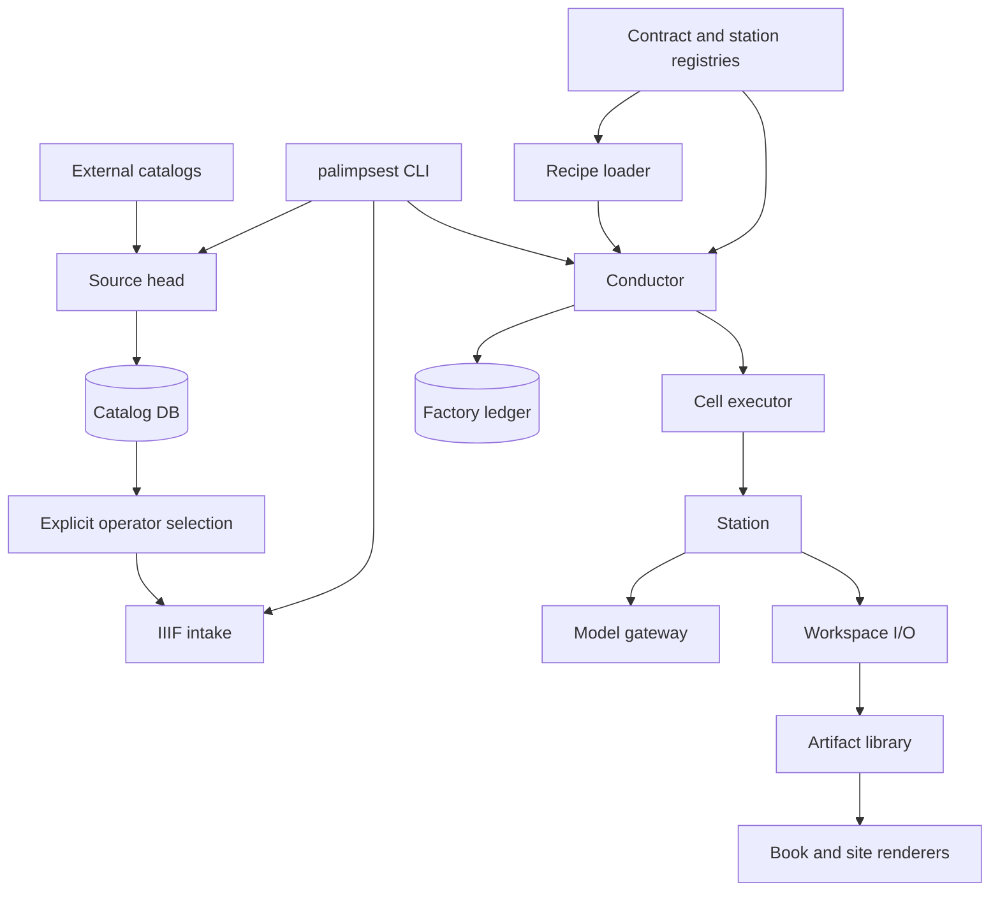

# Palimpsest


**Recovery without erasure.**

Palimpsest turns manuscript images into trustworthy, readable books: an
archival IIIF manifest enters as a work order, a recipe routes every page
through explicit stations, and the final book model renders to EPUB and a
static library. Every transformation declares its inputs and output, every
artifact is written atomically, and every model call is fingerprinted and
costed.

- [`docs/VISION.md`](docs/VISION.md) — the outward narrative: why a factory,
  and what "evidence before fluency" means.
- [`docs/PRODUCT_FOCUS.md`](docs/PRODUCT_FOCUS.md) — the product promise,
  priorities, and scope discipline.
- [`docs/ARCHITECTURE.md`](docs/ARCHITECTURE.md) — the runtime layers in
  detail; the diagram below is its summary.

## Runtime layers



## The line

```text
IIIF manifest
    │
    ▼
metadata + page_list
    │
    ├─ page line, parallel per page
    │  acquire → deframe → dewatermark → flatten → segment → dual read
    │          → align (recipe-dependent) → translate → assemble_page
    │
    └─ manuscript line
       survey → reconstruct → reference → emend → finalize_edition → publish → render_epub
```

The page line preserves the evidence layer: source image, cleaned image,
diplomatic transcription, translation, and their provenance remain separate.
The `deframe`, `dewatermark`, and `flatten` stations also have
`passthrough/v1` variants, so a recipe can hand the reader raw archive bytes.
The manuscript line reconstructs continuity, checks received readings, records
editorial changes in an apparatus, then gives a Sol agent the explicit goal of
reconciling every reader-facing translation and heading against the final
emended text. Publication never mutates the diplomatic transcription.

## Try it — no model calls, no network

The repository ships its own evaluation fixtures, so the evaluation plane runs
at zero cost. Inventory the tracked candidates, suites, and judges:

```bash
python -m palimpsest bench list
```

The hermetic conformance suite (569 tests, all network and model calls mocked)
exercises every production station:

```bash
python -m pytest -q
```

`bench verify --suite <path>` resolves a suite against the local object cache;
for suites whose cases declare external `iiif:` sources, populate the cache
first with `palimpsest bench fetch --suite <path>` (read-only network, sha256
verified). See [`CONTRIBUTING.md`](CONTRIBUTING.md) for the zero-cost bench
workflow.

**Real output:** [`publication/books/`](publication/books/) holds six published
books — the EPUB, the structured book model, and per-folio evidence images —
generated by the production line and committed to the repository. Two samples:


## Install

Palimpsest requires Python 3.11 or newer. Install it in a repository-local
virtual environment so unrelated user packages cannot affect the factory.

Windows PowerShell:

```powershell
python -m venv .venv
.venv\Scripts\Activate.ps1
python -m pip install --upgrade --editable ".[dev]"
```

macOS or Linux:

```bash
python3 -m venv .venv
source .venv/bin/activate
python -m pip install --upgrade --editable ".[dev]"
```

The remaining commands assume that environment is active. Verify it after
installation with `python -m pip check`.

Factory model selectors containing `/` execute through OMP. The production
reading lane uses `token-plan/qwen3.8-max` (Qwen3.8-Max) as its primary and
`openai-codex/gpt-5.6-sol` as its independent secondary. A second Codex call
adjudicates disagreements with high reasoning. The editorial lane uses Codex
for survey, translation, and reconstruction. Ensure `omp` is on `PATH`. Start
one interactive OMP session and run `/login openai-codex` before the first run.
OMP owns provider routing, the Token Plan (DashScope) credential, and OpenAI
OAuth refresh, so no provider API key is required in the environment.

Copy `.env.example` to `.env` to use or override that lane:

```env
PALIMPSEST_MODEL_READING=token-plan/qwen3.8-max
PALIMPSEST_MODEL_READING_SECONDARY=openai-codex/gpt-5.6-sol
PALIMPSEST_MODEL_EDITORIAL=openai-codex/gpt-5.6-sol
PALIMPSEST_MODEL_ADJUDICATOR=openai-codex/gpt-5.6-sol
```

`PALIMPSEST_MODEL_READING` selects the primary `read` model. The secondary and
adjudicator settings apply to dual-reader adjudication.
`PALIMPSEST_MODEL_EDITORIAL` selects the model for `survey`, `translate`, and
`reconstruct`.

When migrating from `PALIMPSEST_MODEL_VISION`, rename it to
`PALIMPSEST_MODEL_READING`. The legacy name is rejected when the new setting is
absent; it is not accepted as an alias.

Every model selector routes through OMP. The direct-provider override was
removed when the Gemini draft engine was retired (2026-08): configuring a
`google/*` or bare `gemini...` selector now fails loudly with the cutover
error pointing at `token-plan/qwen3.8-max`. The
`reference`, `emend`, and `finalize_edition` use the agent executor selected in
each recipe and require that executor's CLI on `PATH`.

## Run a manuscript

### 1. Intake from IIIF

Intake validates a IIIF Presentation 2 or 3 manifest, writes the two source
contracts, and creates the work order in the ledger:

```bash
python -m palimpsest intake \
  --doc-id vatican_pal_lat_1267 \
  --manifest https://digi.vatlib.it/iiif/MSS_Pal.lat.1267/manifest.json \
  --recipe latin_manuscript
```

For a document that already has `library/<doc_id>/metadata.json` and
`page_list.json`, adopt it without rewriting either source record:

```bash
python -m palimpsest adopt \
  --doc-id vatican_pal_lat_1267 \
  --recipe latin_manuscript
```

### 2. Run the line

```bash
python -m palimpsest run \
  --doc-id vatican_pal_lat_1267 \
  --workers 6 \
  --model-workers 3
```

The conductor completes each page station across the selected pages before
advancing to the next. `--workers` controls local image and assembly work;
`--model-workers` separately limits expensive model-backed page cells. The
default model limit is `min(3, --workers)`, which avoids the provider
oversubscription that makes nominally higher concurrency slower.

Each read cell launches its independent primary and secondary readers
concurrently. Calls are bounded per provider by
`PALIMPSEST_MODEL_PROVIDER_WORKERS` (default `3`), so different providers can
work in parallel without flooding either one. Exact agreement after
sanitization becomes the final text without another model call. A disagreement
sends the same image and identity-blind candidate texts to the adjudicator
under a strict JSON schema. The transcription artifact retains the final text,
both candidate readings and their model IDs, the adjudication status, reasoning
and unresolved items, plus combined token and cost usage across every attempted
call.
The `read/omp_instrumented` variant runs the instrumented rig (draft reads
plus RF-DETR count and glyph-classifier witnesses, a quiet gate, and a foreman
audit) behind the same socket.

The conductor resumes from `library/factory.db`. Fresh cells are skipped;
input drift reruns stale cells; configuration drift is reported as outdated
without silently repeating paid work. Refresh a changed station explicitly:

```bash
python -m palimpsest run \
  --doc-id vatican_pal_lat_1267 \
  --refresh read
```

Bound a canary to selected pages and an inclusive station:

```bash
python -m palimpsest run \
  --doc-id gallica_pelliot_chinois_5579 \
  --page page_0001 \
  --page page_0058 \
  --through read \
  --workers 1
```

`--page` is repeatable. A page-selected run cannot cross the recipe's first
manuscript-grain station, so incomplete page evidence never feeds a manuscript
artifact. Successful partial runs leave the work order active; a later full run
reuses their fresh cells.

Use `--executor subprocess` to isolate each cell in a fresh Python process.
The station contract and artifacts are identical under either executor.

Long-running work uses generous, configurable hard deadlines:
`PALIMPSEST_MODEL_TIMEOUT_SECONDS=7200`,
`PALIMPSEST_AGENT_TIMEOUT_SECONDS=14400`, and
`PALIMPSEST_CELL_TIMEOUT_SECONDS=28800`. A model deadline is terminal rather
than automatically repeating an expensive call whose provider-side completion
is unknown. Raise these positive-integer values in `.env` for unusually long
folios; lower them only when a faster failure is preferable.

### 3. Inspect and publish

```bash
python -m palimpsest status --doc-id vatican_pal_lat_1267
python -m palimpsest site
```

Terminal outputs:

```text
library/<doc_id>/book/book.json
library/<doc_id>/book/<doc_id>.epub
site/index.html
```

## Harvest source catalogs

Catalog heads translate repository conventions at the boundary and write
source-local records to `library/catalog.db`; they do not create factory work
orders or merge records that may describe the same manuscript.

```bash
python -m palimpsest catalog init
python -m palimpsest catalog source add-gallica pelliot-chinois \
  --query 'dc.title all "Pelliot chinois"' \
  --collection "Pelliot chinois"
python -m palimpsest catalog sync pelliot-chinois
python -m palimpsest catalog stats
python -m palimpsest catalog records pelliot-chinois --limit 20
```

`normalized-jsonl` is the protocol-neutral import head. Every input line is an
envelope with `source_key`, strict canonical `record`, optional `source_url`
and `source_modified_at`, and the untouched `raw` source payload. Syncs are
resumable, unchanged records do not create revisions, changed records do, and
records absent from a completed refresh are tombstoned rather than deleted.

## Publication

[`publication/`](publication/) is the tracked content release channel.
[`publication/library.json`](publication/library.json) is a versioned bundle
manifest (schema v2) that maps each published `doc_id` to its EPUB and
structured book model; `publication/books/<doc_id>/` holds the EPUB, the book
model, and the per-folio evidence images that anchor every published claim
back to a source page. These are real factory output — produced by the
production line, content-licensed, and committed so readers can inspect what
the system produces without running it.

## Commands

| Command | Purpose |
|---|---|
| `init-db` | Initialize the SQLite inventory and production ledger |
| `catalog` | Register source heads, normalize records, and refresh the pointer catalog |
| `intake` | Turn an IIIF manifest into source contracts and a work order |
| `adopt` | Put an existing library workspace on the line |
| `run` | Execute or resume a recipe |
| `status` | Show work orders or completed station runs |
| `graph` | Render the live artifact/station contract graph |
| `preview` | Render preprocessing stages and segmentation lassos |
| `tune` | Tune segmentation offline without network or ledger writes |
| `site` | Rebuild the static library from published book models |
| `bench` | Verify, run, report, canary, promote, and roll back immutable evaluations |
| `rig` | Export or import one fixed-model agent harness |
| `export-library` | Export validated books and reader assets without a presentation layer |

Run `python -m palimpsest <command> --help` for command-specific options.

### Portable agent rigs

Export one candidate as a `.palrig` archive:

```bash
python -m palimpsest rig export \
  --candidate palimpsest/factory/candidates/read/zh-current-production-moving-v1.yaml \
  --output example.palrig
```

Copy the archive SHA-256 from the export output through a trusted channel. Then
import the archive into the local content-addressed rig store:

```bash
python -m palimpsest rig import example.palrig \
  --expected-sha256 ARCHIVE_SHA256
```

The archive contains the candidate, skill prompt, implementation source
closure, and exact local runtime versions. Import verifies all hashes. It also
checks the installed prompt, source closure, packages, Python version, and OMP
version when the rig uses OMP.

Import does not execute the rig or install its source snapshots. SHA-256 proves
origin only when the expected value came through a trusted channel. A later
benchmark executes the extensions declared by the candidate, so review the rig
before you run it.

The archive does not include credentials, remote model weights, evaluation
cases, gold, or reports. A benchmark can use the stored `rig.palrig` path as a
candidate. The runner treats an imported rig as untracked, so it cannot qualify
for promotion.

## Operating protocols

[`docs/OPERATIONS.md`](docs/OPERATIONS.md) is the canonical runbook for
day-to-day work: manuscript operations, new experiments, candidate and suite
versioning, interrupted-run recovery, promotion, production refresh, rollback,
benchmark governance, and release verification. Use it when deciding what
record to create and which gate comes next; use
[`docs/EVALUATION.md`](docs/EVALUATION.md) for the underlying evaluation
contracts.

Repository-aware coding sessions should use the source-controlled project
skills under `.claude/skills/`:

| Skill | Use it for |
|---|---|
| `palimpsest-experiment` | Design, initialize, run, resume, or review one bounded station experiment |
| `palimpsest-production-ops` | Intake, adopt, run, refresh, recover, publish, and inspect manuscripts |
| `palimpsest-promotion` | Qualification, proposal, canary, promotion, explicit production refresh, and rollback |
| `palimpsest-station-development` | Station variants, new transformations, artifact contracts, and implementation fingerprints |

The skills encode procedure and safety boundaries; the runbook and live
contracts remain the sources of truth. Invoke a skill explicitly when intent
could span experiment, production, and promotion boundaries.

## Swappable seams

### Recipes

A recipe is the route sheet. It chooses station order, models, prompts,
generation parameters, and station options without changing conductor code.
The repository currently ships:

- `latin_manuscript`
- `chinese_scroll_rig`

Recipe keys are strict. Unknown parameters or station options fail during load,
before a network request or paid model call.

### Stations

Every station has one contract. Its logical name and variant identify the
implementation to execute; its localized implementation fingerprint, declared
inputs, optional inputs, and production dependencies determine freshness.
Stations emit exactly one `StationResult`:

```python
name: str
variant: str
implementation_fingerprint: str
grain: "page" | "manuscript"
consumes: tuple[str, ...]
produces: str
run(job) -> StationResult
```

Stations do not call one another, touch the ledger, or choose execution order.
A station reads only its fingerprinted inputs and writes one output. Adding a
new transformation means registering a station and composing it in a recipe;
the conductor remains unchanged.

### Model gateway

Model-backed stations submit provider-neutral `ModelRequest` values and receive
`ModelResponse` values carrying text, token usage, and cost. Provider-specific
SDK behavior, retries, response parsing, and pricing stay behind the gateway.

### Executors

The conductor sends a complete `CellSpec` to an executor. `inline` and
`subprocess` are interchangeable execution policies; neither owns scheduling,
freshness, or the ledger. Agentic editorial stations have a second contained
executor seam for `codex` and `omp`.

### Evaluation and promotion

The evaluation plane runs outside the production conductor. Immutable
candidates and suites drive paired, isolated executions through the same cell
and artifact contracts as production. Scorecards retain quality, hard-limit,
downstream, reliability, latency, cost, and blinded-judge evidence. A qualified
report can produce a compare-and-swap recipe proposal; a protected production
canary gates promotion, and append-only records support exact rollback.
[`docs/EVALUATION.md`](docs/EVALUATION.md) defines the contracts and
`palimpsest bench --help` exposes the operator workflow.

The checked-in suites exercise every production station but are deliberately
non-authorizing development/conformance evidence. Promotion remains blocked
until a curated suite explicitly opts into qualification; changing that flag
changes the suite fingerprint and therefore the evidence identity.
[`docs/BENCH.html`](docs/BENCH.html) carries the design notes behind the
evaluation plane.

### Contracts and workspace

`palimpsest/factory/core/contracts.py` is the artifact type system.
`palimpsest/factory/workspace/layout.py` derives every path from it. The live
contract graph is generated from the contract and station registries:

```bash
python -m palimpsest graph
python -m palimpsest graph --write-docs
```

`docs/CONTRACTS.md` is machine truth and is checked by the test suite.

## Repository layout

```text
palimpsest/
  cli.py                    top-level command entrypoint
  catalog/                  source heads, canonical records, revision store
  factory/
    core/                   contracts, recipes, stations, conductor, ledger
    gateway/                provider-neutral model boundary
    stations/               one module per transformation
    workspace/              atomic I/O and the single path contract
    prompts/                content-hashed prompt files
    recipes/                swappable route sheets
    intake.py               IIIF boundary
    site.py                 static-library renderer
library/
  <doc_id>/                 source records and local factory artifacts
  factory.db                local inventory and production log
  catalog.db                source pointers and immutable record revisions
tests/                      deterministic catalog and factory behavior tests
publication/
  library.json              versioned release bundle manifest
  books/                    released EPUBs, book models, and evidence images
branding/
  assets/                   logo and brand artwork
docs/
  FACTORY.md                architecture and invariants
  CONTRACTS.md              generated live graph
  GLYPHS.md                 alignment and glyph-system design
  EVALUATION.md             evaluation and promotion contracts
  OPERATIONS.md             canonical operator and experiment runbook
```

The research lane (unsupervised separation, frame detection, classifier
training, and the exodia transcription scoring that measures the instrumented
rig) lives in the separate
[`palimpsest-research`](https://github.com/Dexin-Huang/palimpsest-research)
repository and consumes this package as its factory. The pre-cutover tree is
preserved on `archive/pre-research-cutover-2026-08-06`.

Generated images, model artifacts, books, runs, the ledger, and the static site
are local and ignored by Git. `metadata.json` and `page_list.json` are the
portable source records for adopted workspaces.

## Design rules

1. One artifact kind, one contract, one path.
2. One transformation, one station, one output.
3. Prompts are files and are content-hashed.
4. Recipes configure behavior; the conductor does not know corpora.
5. Paid work never reruns implicitly after configuration drift.
6. The diplomatic layer is immutable; reconstruction and emendation sit beside it.
7. The ledger is append-only production history, not the archive itself.
8. Presentation consumes the book model and never reaches back into the line.

## License

- **Code** is MIT licensed — see [`LICENSE`](LICENSE).
- **Content** — the published books, EPUBs, book models, and editorial output
  under [`publication/`](publication/), plus brand assets under
  `branding/assets/` — is licensed CC-BY-4.0 — see
  [`LICENSE-content`](LICENSE-content).

## Contributing

See [`CONTRIBUTING.md`](CONTRIBUTING.md): development setup, the hermetic
test conventions (569 tests, no network, no model calls), the zero-cost bench
workflow, and the branch and commit conventions.

The pre-cutover repository is preserved remotely on
`archive/pre-factory-cutover-2026-07-20`.
