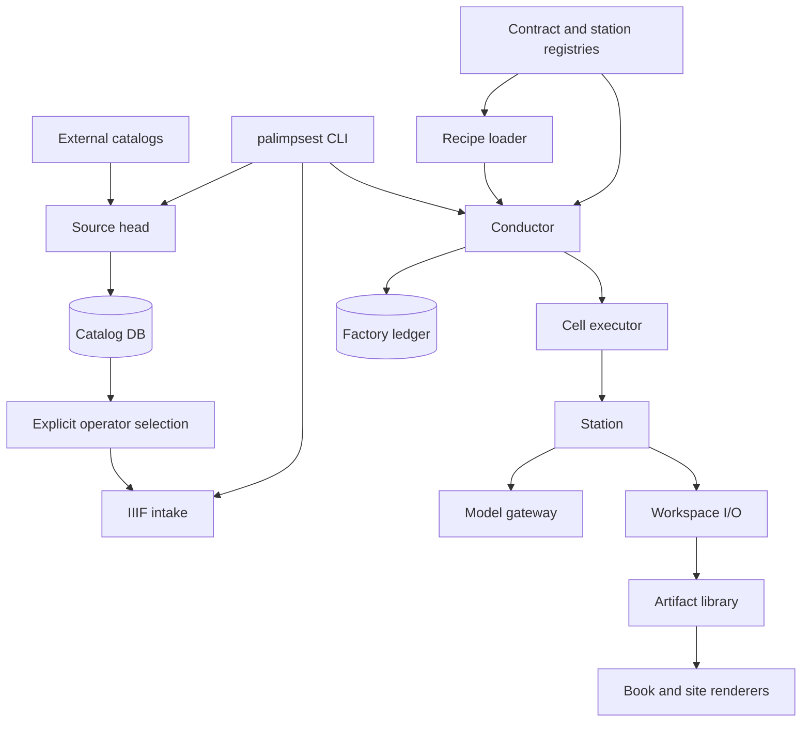

# Architecture

Palimpsest has a continuously refreshed source catalog in front of one
production factory. Source heads translate repository conventions into
source-grounded pointers in `catalog.db`. An operator explicitly selects a
record and supplies its IIIF manifest to intake; catalog presence never creates
a work order. The factory then moves provenance-stamped artifacts through a
validated recipe and emits a readable EPUB and static HTML book.

[`FACTORY.md`](FACTORY.md) defines production in detail.
[`CONTRACTS.md`](CONTRACTS.md) is its generated artifact and station graph.
Research and candidate evaluation live in the separate `palimpsest-research`
repository; this factory executes the production configuration selected in a
recipe without deciding whether that configuration is good.

## Runtime layers



### Catalog layer

`palimpsest/catalog/heads.py` is the external source boundary. Each registered
head owns one protocol convention, pagination cursor, source-specific parsing,
and normalization into `NormalizedRecord`. The initial heads are Gallica SRU
and strict normalized JSONL. A source head never decides that two repository
records are the same physical manuscript.

`catalog/database.py` assigns deterministic identities from
`source_id + source_key`, stores the untouched source payload beside the
normalized projection, and appends a revision only when content changes.
Completed refreshes tombstone missing records; resumed refreshes continue after
the last committed page. Cross-source conflicts remain separate source claims.
Future object-identity assertions belong above this layer and must never rewrite
source history.

### Command and intake layer

`palimpsest/cli.py` owns argument parsing and dispatch. Production commands are
top-level; station modules are imported only by commands that need them.
`palimpsest/factory/intake.py` is the external archive boundary. It fetches and
normalizes IIIF manifests, derives stable page identities, validates source
records, and writes them atomically.

### Contract and recipe layer

`palimpsest/factory/core/contracts.py` defines every artifact kind.
`palimpsest/factory/core/registry.py` registers station implementations and
checks their declared inputs and output. `palimpsest/factory/core/recipe.py`
loads YAML route sheets, validates station order, checks model bindings, and
rejects undeclared parameters or options.

Recipes are the full production slot authority. A model-backed slot names its
station variant, exact model, prompt, parameters, and options directly; there
is no second candidate or promotion registry in the factory.

### Orchestration layer

`palimpsest/factory/core/conductor.py` resolves work orders, computes freshness,
schedules page cells, gates manuscript cells, and records each outcome.
`palimpsest/factory/core/executors.py` provides inline and isolated execution
with one `CellSpec -> CellOutcome` contract. `palimpsest/factory/core/cell.py`
runs a resolved station, validates its output, commits it atomically, and adds
provenance.

### Station layer

`palimpsest/factory/stations/` contains one module per transformation. A station
owns domain logic only. It declares its grain, consumed kinds, produced kind,
model use, and accepted recipe keys. It does not schedule other stations,
choose freshness, or write the ledger.

Agent-backed editorial work uses `palimpsest/factory/agent_cell.py`. Each agent
receives a recreated airlock containing a station instruction, declared JSON
evidence, selected images, and an output directory. Validation and bounded
repair happen before the artifact returns to the conductor.

### Gateway layer

`palimpsest/factory/gateway/client.py` is the provider-neutral model API.
Provider adapters own client construction and response parsing. Structured
output decoding, retries, usage, and error classification are
centralized here rather than repeated in stations.

### Storage layer

`library/catalog.db` holds source pointers, immutable record revisions, and
sync events. It is deliberately separate from `library/factory.db`: catalog
presence is evidence, not production authorization.

`palimpsest/factory/workspace/layout.py` resolves every production artifact path
from the contract registry. `workspace/io.py` owns atomic JSON, text, and binary
writes. `core/ledger.py` owns factory work orders and append-only production
history. Both databases are indexes; raw catalog payloads and factory artifacts
remain independently auditable.

### Publication layer

`stations/finalize_edition.py` reviews every section against the final emended
reading and the page readers' adjudication reasoning and unresolved items, then
produces only reader-facing prose. `stations/publish.py`
deterministically combines that prose with immutable evidence into one
content-only book model. `stations/render_epub.py` renders EPUB from that model.
`factory/site.py` rebuilds the hosted shelf and reader from published book
models. Presentation never reaches back into intermediate station outputs.

## Dependency direction

```text
cli
  -> catalog / intake / conductor / graph / preview / tune / site
catalog
  -> source heads / normalized records / catalog database
conductor
  -> recipe / registry / executors / ledger / workspace
executors
  -> cell
cell
  -> station registry / contracts / workspace
stations
  -> station contract / gateway / imaging / workspace
publication
  -> book model only
```

Lower layers do not import the command layer. Stations do not import the
conductor or ledger. Workspace paths are never constructed independently of
the contract registry.

## Source tree

```text
palimpsest/
  cli.py
  catalog/
    records.py
    heads.py
    database.py
    sync.py
    cli.py
  factory/
    intake.py
    graph.py
    preview.py
    imaging.py
    glyphs.py
    seams.py
    apparatus.py
    site.py
    config.py
    core/
      contracts.py
      registry.py
      recipe.py
      station.py
      conductor.py
      executors.py
      cell.py
      ledger.py
    gateway/
      client.py
      omp.py
      protocol.py
    workspace/
      layout.py
      io.py
    stations/
    recipes/
    prompts/
```

## Change rules

- Add or change an artifact in `core/contracts.py`; regenerate
  `docs/CONTRACTS.md`.
- Add an external catalog convention as a source head; preserve its raw payload
  and normalize before persistence.
- Keep source-record identity separate from tentative manuscript-object
  identity. Never merge conflicting source claims during harvest.
- Add a station in `stations/`, register it, and declare every accepted recipe
  key on the station.
- Change production order only in a recipe.
- Add a model provider behind the gateway contract.
- Add presentation formats from the book model, not from intermediate files.
- Preserve atomic writes, append-only run history, and explicit refresh for
  paid configuration changes.
