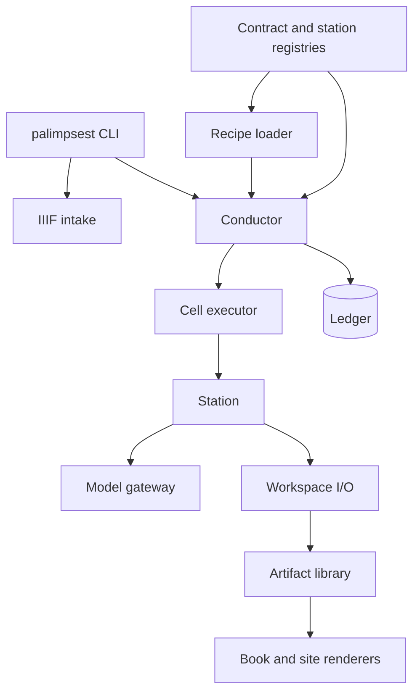

# Architecture

Palimpsest is one factory: an IIIF manifest enters, provenance-stamped
artifacts move through a validated recipe, and a readable book leaves as EPUB
and static HTML. [`FACTORY.md`](FACTORY.md) defines the system in detail;
[`CONTRACTS.md`](CONTRACTS.md) is the generated artifact and station graph.

## Runtime layers



### Command and intake layer

`palimpsest/cli.py` owns argument parsing and dispatch. Production commands are
top-level; station modules are imported only by commands that need them.
`palimpsest/factory/intake.py` is the external archive boundary. It fetches and
normalizes IIIF manifests, derives stable page identities, validates source
records, and writes them atomically.

### Contract and recipe layer

`palimpsest/factory/core/contracts.py` defines every artifact kind.
`palimpsest/factory/core/registry.py` registers station implementations and
checks their declared inputs and output. `palimpsest/factory/core/recipe.py`
loads YAML route sheets, validates station order, checks model bindings, and
rejects undeclared parameters or options.

### Orchestration layer

`palimpsest/factory/core/conductor.py` resolves work orders, computes freshness,
schedules page cells, gates manuscript cells, and records each outcome.
`palimpsest/factory/core/executors.py` provides inline and isolated execution
with one `CellSpec -> CellOutcome` contract. `palimpsest/factory/core/cell.py`
runs a resolved station, validates its output, commits it atomically, and adds
provenance.

### Station layer

`palimpsest/factory/stations/` contains one module per transformation. A station
owns domain logic only. It declares its grain, consumed kinds, produced kind,
model use, and accepted recipe keys. It does not schedule other stations,
choose freshness, or write the ledger.

Agent-backed editorial work uses `palimpsest/factory/agent_cell.py`. Each agent
receives a recreated airlock containing a station instruction, declared JSON
evidence, selected images, and an output directory. Validation and bounded
repair happen before the artifact returns to the conductor.

### Gateway layer

`palimpsest/factory/gateway/client.py` is the provider-neutral model API.
Provider adapters own client construction and response parsing. Pricing,
structured-output decoding, retries, usage, and error classification are
centralized here rather than repeated in stations.

### Storage layer

`palimpsest/factory/workspace/layout.py` resolves every artifact path from the
contract registry. `workspace/io.py` owns atomic JSON, text, and binary writes.
`core/ledger.py` owns the SQLite work-order inventory and append-only production
history. The ledger is an index; artifacts remain independently auditable from
their provenance stamps.

### Publication layer

`stations/publish.py` compiles one content-only book model.
`stations/render_epub.py` renders EPUB from that model. `factory/site.py`
rebuilds the hosted shelf and reader from published book models. Presentation
never reaches back into intermediate station outputs.

## Dependency direction

```text
cli
  -> intake / conductor / graph / preview / evaluate / site
conductor
  -> recipe / registry / executors / ledger / workspace
executors
  -> cell
cell
  -> station registry / contracts / workspace
stations
  -> station contract / gateway / imaging / workspace
publication
  -> book model only
```

Lower layers do not import the command layer. Stations do not import the
conductor or ledger. Workspace paths are never constructed independently of
the contract registry.

## Source tree

```text
palimpsest/
  cli.py
  factory/
    intake.py
    graph.py
    preview.py
    evaluate.py
    imaging.py
    glyphs.py
    seams.py
    apparatus.py
    agent_cell.py
    site.py
    config.py
    core/
      contracts.py
      registry.py
      recipe.py
      station.py
      conductor.py
      executors.py
      cell.py
      ledger.py
    gateway/
      client.py
      gemini.py
      pricing.py
    workspace/
      layout.py
      io.py
    stations/
    recipes/
    prompts/
```

## Change rules

- Add or change an artifact in `core/contracts.py`; regenerate
  `docs/CONTRACTS.md`.
- Add a station in `stations/`, register it, and declare every accepted recipe
  key on the station.
- Change production order only in a recipe.
- Add a model provider behind the gateway contract.
- Add presentation formats from the book model, not from intermediate files.
- Preserve atomic writes, append-only run history, and explicit refresh for
  paid configuration changes.
