# The Contract Graph

<!-- GENERATED by `palimpsest graph --write-docs` — do not edit. -->

Everything in the factory is input → transformation → output. This is
the live graph, rendered from the station and contract registries in
code. This generated file is the canonical contract reference.

```mermaid
flowchart TB
  kind_page_list --> station_acquire
  station_acquire --> kind_page_image
  kind_page_image_clean --> station_align
  kind_page_transcription --> station_align
  station_align --> kind_page_alignment
  kind_page_transcription --> station_assemble_page
  kind_page_translation --> station_assemble_page
  station_assemble_page --> kind_page_assembled
  kind_page_image --> station_deframe
  station_deframe --> kind_page_image_framed
  kind_page_image_framed --> station_dewatermark
  station_dewatermark --> kind_page_image_unmarked
  kind_manuscript --> station_emend
  kind_reference --> station_emend
  kind_page_assembled --> station_emend
  kind_page_image_clean --> station_emend
  station_emend --> kind_emendations
  kind_page_transcription --> station_finalize_edition
  kind_manuscript --> station_finalize_edition
  kind_reference --> station_finalize_edition
  kind_emendations --> station_finalize_edition
  station_finalize_edition --> kind_edition
  kind_page_image_unmarked --> station_flatten
  station_flatten --> kind_page_image_clean
  kind_metadata --> station_publish
  kind_manuscript --> station_publish
  kind_translation_brief --> station_publish
  kind_page_transcription --> station_publish
  kind_page_image --> station_publish
  kind_page_image_clean --> station_publish
  kind_page_translation --> station_publish
  kind_reference --> station_publish
  kind_emendations --> station_publish
  kind_edition --> station_publish
  kind_page_alignment -. optional .-> station_publish
  station_publish --> kind_book
  kind_page_image_clean --> station_read
  kind_page_regions --> station_read
  station_read --> kind_page_transcription
  kind_page_assembled --> station_reconstruct
  station_reconstruct --> kind_manuscript
  kind_manuscript --> station_reference
  station_reference --> kind_reference
  kind_book --> station_render_epub
  station_render_epub --> kind_book_epub
  kind_page_image_clean --> station_segment
  station_segment --> kind_page_regions
  kind_page_transcription --> station_survey
  station_survey --> kind_translation_brief
  kind_page_image --> station_transcribe
  station_transcribe --> kind_page_transcription_draft
  kind_page_transcription --> station_translate
  kind_translation_brief --> station_translate
  station_translate --> kind_page_translation
  station_acquire(["acquire<br/><i>page</i>"])
  style station_acquire fill:#eef2ec,stroke:#9ab08f
  station_align(["align<br/><i>page</i>"])
  style station_align fill:#eef2ec,stroke:#9ab08f
  station_assemble_page(["assemble_page<br/><i>page</i>"])
  style station_assemble_page fill:#eef2ec,stroke:#9ab08f
  station_deframe(["deframe<br/><i>page</i>"])
  style station_deframe fill:#eef2ec,stroke:#9ab08f
  station_dewatermark(["dewatermark<br/><i>page</i>"])
  style station_dewatermark fill:#eef2ec,stroke:#9ab08f
  station_emend(["emend ✱<br/><i>manuscript</i>"])
  style station_emend fill:#eef2ec,stroke:#9ab08f
  station_finalize_edition(["finalize_edition ✱<br/><i>manuscript</i>"])
  style station_finalize_edition fill:#eef2ec,stroke:#9ab08f
  station_flatten(["flatten<br/><i>page</i>"])
  style station_flatten fill:#eef2ec,stroke:#9ab08f
  station_publish(["publish<br/><i>manuscript</i>"])
  style station_publish fill:#eef2ec,stroke:#9ab08f
  station_read(["read ✱<br/><i>page</i>"])
  style station_read fill:#eef2ec,stroke:#9ab08f
  station_reconstruct(["reconstruct ✱<br/><i>manuscript</i>"])
  style station_reconstruct fill:#eef2ec,stroke:#9ab08f
  station_reference(["reference ✱<br/><i>manuscript</i>"])
  style station_reference fill:#eef2ec,stroke:#9ab08f
  station_render_epub(["render_epub<br/><i>manuscript</i>"])
  style station_render_epub fill:#eef2ec,stroke:#9ab08f
  station_segment(["segment<br/><i>page</i>"])
  style station_segment fill:#eef2ec,stroke:#9ab08f
  station_survey(["survey ✱<br/><i>manuscript</i>"])
  style station_survey fill:#eef2ec,stroke:#9ab08f
  station_transcribe(["transcribe ✱<br/><i>page</i>"])
  style station_transcribe fill:#eef2ec,stroke:#9ab08f
  station_translate(["translate ✱<br/><i>page</i>"])
  style station_translate fill:#eef2ec,stroke:#9ab08f
  kind_book["book"]
  kind_book_epub["book_epub"]
  kind_edition["edition"]
  kind_emendations["emendations"]
  kind_manuscript["manuscript"]
  kind_metadata[("metadata")]
  style kind_metadata fill:#fdf6e3,stroke:#c9b99a
  kind_page_alignment["page_alignment"]
  kind_page_assembled["page_assembled"]
  kind_page_image["page_image"]
  kind_page_image_clean["page_image_clean"]
  kind_page_image_framed["page_image_framed"]
  kind_page_image_unmarked["page_image_unmarked"]
  kind_page_list[("page_list")]
  style kind_page_list fill:#fdf6e3,stroke:#c9b99a
  kind_page_regions["page_regions"]
  kind_page_transcription["page_transcription"]
  kind_page_transcription_draft["page_transcription_draft"]
  kind_page_translation["page_translation"]
  kind_reference["reference"]
  kind_translation_brief["translation_brief"]
```

✱ = makes model calls.

## Artifact contracts

| Kind | Grain | Format | Required fields | Stored at |
|---|---|---|---|---|
| `metadata` | manuscript | json | `doc_id` | `metadata.json` |
| | | | *Catalog identity and immutable source provenance for one work order.* | |
| `page_list` | manuscript | json | `doc_id`, `pages` | `page_list.json` |
| | | | *Ordered source canvases and image URLs consumed by the page line.* | |
| `page_image` | page | jpeg | — | `<kind>/<page_id>.jpg` |
| | | | *Page image exactly as the archive delivered it.* | |
| `page_image_framed` | page | jpeg | — | `<kind>/<page_id>.jpg` |
| | | | *Cropped to the detected parchment frame — backdrop/binding gone.* | |
| `page_image_unmarked` | page | jpeg | — | `<kind>/<page_id>.jpg` |
| | | | *Digital overlays (watermarks, stamps) painted back to background.* | |
| `page_image_clean` | page | jpeg | — | `<kind>/<page_id>.jpg` |
| | | | *Illumination-flattened study image; what segment and read consume.* | |
| `page_regions` | page | json | `doc_id`, `page_id`, `route`, `image`, `regions` | `<kind>/<page_id>.json` |
| | | | *Polygon lassos + the routing decision (blank | full_page | segmented).* | |
| `page_transcription_draft` | page | json | `doc_id`, `page_id`, `page_seq`, `canvas_id`, `text`, `requested_model`, `model`, `finish_reason` | `<kind>/<page_id>.json` |
| | | | *Unreviewed full-image transcription from one direct reader call.* | |
| `page_transcription` | page | json | `doc_id`, `page_id`, `text`, `route`, `regions`, `candidate_readings`, `adjudication_status`, `adjudication_requested_model`, `adjudication_model`, `adjudication_reasoning`, `unresolved`, `adjudication_error` | `<kind>/<page_id>.json` |
| | | | *Diplomatic transcription; per-region texts when the page was segmented.* | |
| `page_transcription_audit` | page | json | `doc_id`, `page_id`, `page_seq`, `canvas_id`, `text`, `route`, `regions`, `candidate_readings`, `adjudication_status`, `adjudication_requested_model`, `adjudication_model`, `adjudication_reasoning`, `unresolved`, `adjudication_error` | `<kind>/<page_id>.json` |
| | | | *Auditor-corrected transcription grounded in the raw archive image.* | |
| `page_translation` | page | json | `doc_id`, `page_id`, `translation`, `flags` | `<kind>/<page_id>.json` |
| | | | *English translation of one page, with continuity flags.* | |
| `page_alignment` | page | json | `doc_id`, `page_id`, `columns`, `stats` | `<kind>/<page_id>.json` |
| | | | *Forced alignment: per-character ink bounding boxes + count stats. Unbound characters are marked, never forced.* | |
| `page_assembled` | page | json | `doc_id`, `page_id`, `original`, `translation`, `inputs` | `<kind>/<page_id>.json` |
| | | | *Deterministic page pair: diplomatic original and its translation.* | |
| `translation_brief` | manuscript | json | `document`, `glossary`, `outline` | `translation_brief.json` |
| | | | *The jig: glossary, outline, entities, flags guiding every translate.* | |
| `manuscript` | manuscript | json | `doc_id`, `sections`, `joins`, `readers_note` | `manuscript.json` |
| | | | *Reconstruction: sections in both languages + auditable joins.* | |
| `reference` | manuscript | json | `doc_id`, `identification`, `reference_points` | `reference.json` |
| | | | *The reference dossier: document identification plus, per passage that tracks a transmitted text, the controlling received wording with citation, confidence, and verification source.* | |
| `emendations` | manuscript | json | `doc_id`, `sections`, `apparatus` | `emendations.json` |
| | | | *The final editorial pass: an emended reading per section + the apparatus recording every change. The diplomatic layer is never edited; this sits beside it.* | |
| `edition` | manuscript | json | `doc_id`, `readers_note`, `sections` | `edition.json` |
| | | | *Reader-facing prose reconciled against the final emended reading: one heading and translation per manuscript section, plus the manuscript-level reader's note.* | |
| `book` | manuscript | json | `schema_version`, `profile`, `doc_id`, `identity`, `languages`, `readers_note`, `folios`, `sections`, `apparatus`, `colophon` | `book/book.json` |
| | | | *Book Model v1: normalized folios, reader-facing sections, explicit source descriptors, editorial apparatus, and production colophon.* | |
| `book_epub` | manuscript | epub | — | `book/{doc_id}.epub` |
| | | | *EPUB 3 rendering of the book model.* | |

## Transformations

| Station | Implementation | Grain | Consumes | Produces | Model |
|---|---|---|---|---|---|
| `acquire` | `c4fa662158caebc4` | page | `page_list` | `page_image` | no |
| `align` | `077860b4def09ca7` | page | `page_image_clean`, `page_transcription` | `page_alignment` | no |
| `assemble_page` | `c95b74499c394ba5` | page | `page_transcription`, `page_translation` | `page_assembled` | no |
| `deframe` | `904d45ddcaaab4cb` | page | `page_image` | `page_image_framed` | no |
| `dewatermark` | `b016d96452765c72` | page | `page_image_framed` | `page_image_unmarked` | no |
| `emend` | `67ba2713fb97056e` | manuscript | `manuscript`, `reference`, `page_assembled`, `page_image_clean` | `emendations` | yes |
| `finalize_edition` | `7691b7115d1f4e81` | manuscript | `page_transcription`, `manuscript`, `reference`, `emendations` | `edition` | yes |
| `flatten` | `a7fd8bd7d83e801d` | page | `page_image_unmarked` | `page_image_clean` | no |
| `publish` | `732efe190982f59a` | manuscript | `metadata`, `manuscript`, `translation_brief`, `page_transcription`, `page_image`, `page_image_clean`, `page_translation`, `reference`, `emendations`, `edition`, `page_alignment` (optional) | `book` | no |
| `read` | `7d14f8ea21ddec98` | page | `page_image_clean`, `page_regions` | `page_transcription` | yes |
| `reconstruct` | `08653466fee549d6` | manuscript | `page_assembled` | `manuscript` | yes |
| `reference` | `a9b9f2fea30fd22c` | manuscript | `manuscript` | `reference` | yes |
| `render_epub` | `b8dadc29d6be9bd8` | manuscript | `book` | `book_epub` | no |
| `segment` | `bc818149478a0ba8` | page | `page_image_clean` | `page_regions` | no |
| `survey` | `2821108031dfb90a` | manuscript | `page_transcription` | `translation_brief` | yes |
| `transcribe` | `f5a9bdb5c868bec5` | page | `page_image` | `page_transcription_draft` | yes |
| `translate` | `10e83beb41263834` | page | `page_transcription`, `translation_brief` | `page_translation` | yes |

Contracts are enforced twice at runtime: a station referencing an
unknown kind fails at registration, and a JSON artifact missing its
kind's required fields fails its cell before anything is written.
