# The Contract Graph

<!-- GENERATED by `palimpsest factory graph --write-docs` — do not edit. -->

Everything in the factory is input → transformation → output. This is
the live graph, rendered from the station and contract registries in
code; if it disagrees with `docs/BLUEPRINT.html`, THIS file is right.

```mermaid
flowchart TB
  page_list --> acquire
  acquire --> page_image
  page_transcription --> assemble_page
  page_translation --> assemble_page
  assemble_page --> page_assembled
  page_image --> deframe
  deframe --> page_image_framed
  page_image_framed --> dewatermark
  dewatermark --> page_image_unmarked
  manuscript --> emend
  page_assembled --> emend
  emend --> emendations
  page_image_unmarked --> flatten
  flatten --> page_image_clean
  manuscript --> publish
  publish --> book
  page_image_clean --> read
  page_regions --> read
  read --> page_transcription
  page_assembled --> reconstruct
  reconstruct --> manuscript
  book --> render_epub
  render_epub --> book_epub
  page_image_clean --> segment
  segment --> page_regions
  page_transcription --> survey
  survey --> translation_brief
  page_transcription --> translate
  translation_brief --> translate
  translate --> page_translation
  acquire(["acquire<br/><i>page</i>"])
  style acquire fill:#eef2ec,stroke:#9ab08f
  assemble_page(["assemble_page<br/><i>page</i>"])
  style assemble_page fill:#eef2ec,stroke:#9ab08f
  deframe(["deframe<br/><i>page</i>"])
  style deframe fill:#eef2ec,stroke:#9ab08f
  dewatermark(["dewatermark<br/><i>page</i>"])
  style dewatermark fill:#eef2ec,stroke:#9ab08f
  emend(["emend ✱<br/><i>manuscript</i>"])
  style emend fill:#eef2ec,stroke:#9ab08f
  flatten(["flatten<br/><i>page</i>"])
  style flatten fill:#eef2ec,stroke:#9ab08f
  publish(["publish<br/><i>manuscript</i>"])
  style publish fill:#eef2ec,stroke:#9ab08f
  read(["read ✱<br/><i>page</i>"])
  style read fill:#eef2ec,stroke:#9ab08f
  reconstruct(["reconstruct ✱<br/><i>manuscript</i>"])
  style reconstruct fill:#eef2ec,stroke:#9ab08f
  render_epub(["render_epub<br/><i>manuscript</i>"])
  style render_epub fill:#eef2ec,stroke:#9ab08f
  segment(["segment<br/><i>page</i>"])
  style segment fill:#eef2ec,stroke:#9ab08f
  survey(["survey ✱<br/><i>manuscript</i>"])
  style survey fill:#eef2ec,stroke:#9ab08f
  translate(["translate ✱<br/><i>page</i>"])
  style translate fill:#eef2ec,stroke:#9ab08f
  book["book"]
  book_epub["book_epub"]
  emendations["emendations"]
  manuscript["manuscript"]
  page_assembled["page_assembled"]
  page_image["page_image"]
  page_image_clean["page_image_clean"]
  page_image_framed["page_image_framed"]
  page_image_unmarked["page_image_unmarked"]
  page_list[("page_list")]
  style page_list fill:#fdf6e3,stroke:#c9b99a
  page_regions["page_regions"]
  page_transcription["page_transcription"]
  page_translation["page_translation"]
  translation_brief["translation_brief"]
```

✱ = makes model calls.

## Artifact contracts

| Kind | Grain | Format | Required fields | Stored at |
|---|---|---|---|---|
| `page_image` | page | jpeg | — | `<kind>/<page_id>.jpg` |
| | | | *Page image exactly as the archive delivered it.* | |
| `page_image_framed` | page | jpeg | — | `<kind>/<page_id>.jpg` |
| | | | *Cropped to the detected parchment frame — backdrop/binding gone.* | |
| `page_image_unmarked` | page | jpeg | — | `<kind>/<page_id>.jpg` |
| | | | *Digital overlays (watermarks, stamps) painted back to background.* | |
| `page_image_clean` | page | jpeg | — | `<kind>/<page_id>.jpg` |
| | | | *Illumination-flattened study image; what segment and read consume.* | |
| `page_regions` | page | json | `doc_id`, `page_id`, `route`, `image`, `regions` | `<kind>/<page_id>.json` |
| | | | *Polygon lassos + the routing decision (blank | full_page | segmented).* | |
| `page_transcription` | page | json | `doc_id`, `page_id`, `text`, `route`, `regions` | `<kind>/<page_id>.json` |
| | | | *Diplomatic transcription; per-region texts when the page was segmented.* | |
| `page_translation` | page | json | `doc_id`, `page_id`, `translation`, `flags` | `<kind>/<page_id>.json` |
| | | | *English translation of one page, with continuity flags.* | |
| `page_assembled` | page | json | `doc_id`, `page_id`, `original`, `translation`, `inputs` | `<kind>/<page_id>.json` |
| | | | *The small loop's finished part: original ∥ translation, aligned.* | |
| `translation_brief` | manuscript | json | `version`, `document`, `glossary`, `outline` | `translation_brief.json` |
| | | | *The jig: glossary, outline, entities, flags guiding every translate.* | |
| `manuscript` | manuscript | json | `doc_id`, `sections`, `joins`, `readers_note` | `manuscript.json` |
| | | | *Reconstruction: sections in both languages + auditable joins.* | |
| `emendations` | manuscript | json | `doc_id`, `sections`, `apparatus` | `emendations.json` |
| | | | *The final editorial pass: an emended reading per section + the apparatus recording every change. The diplomatic layer is never edited; this sits beside it.* | |
| `book` | manuscript | json | `doc_id`, `title`, `language`, `chapters`, `colophon` | `book/book.json` |
| | | | *The book model: bilingual chapters + provenance colophon.* | |
| `book_epub` | manuscript | epub | — | `book/{doc_id}.epub` |
| | | | *EPUB 3 rendering of the book model.* | |

## Transformations

| Station | Version | Grain | Consumes | Produces | Model |
|---|---|---|---|---|---|
| `acquire` | acquire/v1 | page | `page_list` | `page_image` | no |
| `assemble_page` | assemble_page/v1 | page | `page_transcription`, `page_translation` | `page_assembled` | no |
| `deframe` | deframe/v1 | page | `page_image` | `page_image_framed` | no |
| `dewatermark` | dewatermark/v1 | page | `page_image_framed` | `page_image_unmarked` | no |
| `emend` | emend/v1 | manuscript | `manuscript`, `page_assembled` | `emendations` | yes |
| `flatten` | flatten/v1 | page | `page_image_unmarked` | `page_image_clean` | no |
| `publish` | publish/v1 | manuscript | `manuscript` | `book` | no |
| `read` | read/v3 | page | `page_image_clean`, `page_regions` | `page_transcription` | yes |
| `reconstruct` | reconstruct/v1 | manuscript | `page_assembled` | `manuscript` | yes |
| `render_epub` | render_epub/v1 | manuscript | `book` | `book_epub` | no |
| `segment` | segment/v1 | page | `page_image_clean` | `page_regions` | no |
| `survey` | survey/v1 | manuscript | `page_transcription` | `translation_brief` | yes |
| `translate` | translate/v1 | page | `page_transcription`, `translation_brief` | `page_translation` | yes |

Contracts are enforced twice at runtime: a station referencing an
unknown kind fails at registration, and a JSON artifact missing its
kind's required fields fails its cell before anything is written.
