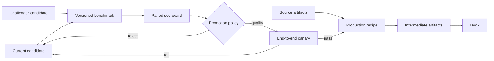

# Evaluation and Promotion Blueprint

Status: **core implemented; tracked evidence remains non-authorizing** (2026-07-20).

Palimpsest already has a production contract graph: each station consumes named
artifacts, performs one transformation, and produces one validated artifact.
This document defines the second graph the factory needs: an evaluation and
promotion system that can prove whether a replacement model, prompt,
configuration, algorithm, or station implementation is better before it enters
production.

[`FACTORY.md`](FACTORY.md) remains the source of truth for the production
runtime. [`CONTRACTS.md`](CONTRACTS.md) remains the generated source of truth
for live artifact and logical station shapes. This document is the normative
design and operator contract for the implemented improvement plane.

For step-by-step manuscript, experiment, recovery, promotion, rollback, and
release procedures, use the canonical
[`OPERATIONS.md`](OPERATIONS.md) runbook. This document defines why those gates
exist and the records they enforce.

## 1. Purpose

The factory must answer two different questions:

1. **Can the line run?** Artifact and station contracts answer this.
2. **Should this component replace the current one?** Evaluation contracts must
   answer this.

A modular pipeline without evaluation is replaceable but not systematically
improvable. An evaluation system without stable production contracts can rank
experiments but cannot safely promote them. Palimpsest needs both.



The desired system is operationally closed but evidentially anchored:

```text
localized mission
-> frozen benchmark
-> paired candidate evaluation
-> explicit promotion decision
-> production canary
-> selected recipe
-> observed product outcome
-> next candidate
```

It must never become epistemically circular: a producer cannot generate its own
answers, judge them with the same uncalibrated method, and declare itself
better. Gold data, source evidence, deterministic checks, blinded judges, and
periodic human adjudication anchor the loop outside itself.

## 2. Terminology

### 2.1 Station

A logical transformation in the production graph, such as `read`, `align`, or
`emend`. Its artifact socket is defined by its grain, required inputs, optional
inputs, and one output.

### 2.2 Variant

A code implementation of a station socket. Multiple variants may be evaluated,
but a production recipe selects exactly one variant for each station it uses.
Examples for `read` could be direct multimodal reading, OCR plus decoder, or an
ensemble.

### 2.3 Candidate

A complete, immutable battery configuration:

```text
station
+ variant
+ model, if any
+ prompt hash, if any
+ generation parameters
+ station options
+ implementation fingerprint
= candidate fingerprint
```

A model name alone is not a candidate. Changing the prompt, preprocessing
option, implementation source, or any other behavior-bearing field creates a
different candidate fingerprint.

#### 2.3.1 Agent rig

An agent rig is the resolved execution harness for one model-backed candidate:

```text
fixed model
+ skill prompt
+ parameters and station options
+ tool and extension implementation
+ station execution protocol
+ local runtime versions
= rig fingerprint
```

The candidate fingerprint identifies the Palimpsest behavior record. The rig
fingerprint also covers the complete source closure and local runtime manifest.
The evaluation suite, cases, gold, and reports are not part of the rig.

### 2.4 Evaluation suite

A versioned specification containing benchmark cases, metrics, slices,
operational budgets, downstream probes, and a promotion policy for one station.

### 2.5 Evaluation case

One immutable test example with input artifact references, source hashes,
strata, and scorer-only reference data. Candidate execution receives inputs but
never receives hidden gold answers.

### 2.6 Scorecard

The immutable report from a paired baseline/candidate run. It contains
per-case observations, aggregates, confidence intervals, failures, costs,
latency, judge identity, and a machine-derived qualification decision.

### 2.7 Promotion

An append-only decision that qualifies one candidate to replace another in a
named recipe slot. Qualification does not bypass a production canary or the
existing explicit-refresh rule.

### 2.8 Rollback

A new append-only decision restoring the exact previous candidate. History is
never rewritten and candidate definitions are never mutated in place.

## 3. Design principles

1. **Local goals derive from the product goal.** A station metric is valid only
   if it measures a necessary product property or has demonstrated downstream
   value.
2. **Local does not mean isolated.** Promotion requires local improvement and
   downstream non-regression.
3. **Contracts fail before scores.** An invalid artifact is a failed case, not a
   low-quality artifact eligible for averaging.
4. **Compare paired cases.** Baseline and challenger run on identical frozen
   inputs.
5. **Use hard gates before optimization.** Hallucination, evidence loss,
   provenance gaps, and catastrophic failures cannot be traded away for a
   higher average.
6. **Do not hide tradeoffs in one universal score.** Report a quality,
   reliability, operations, and downstream vector.
7. **Prefer direct truth.** Deterministic checks and expert gold outrank model
   preference. Judges cover ambiguity; they do not replace ground truth.
8. **Keep evaluation outside production.** Live manuscripts do not pay for a
   judge on every cell. The benchmark is an isolated test track.
9. **Keep one production producer.** Many candidates may exist in the lab; one
   candidate occupies each recipe slot.
10. **Make every identity content-derived.** Human-readable IDs are labels;
    fingerprints establish identity.
11. **Make decisions reproducible.** Suite, cases, inputs, gold, candidates,
    judges, metrics, and policy are all versioned and hashed.
12. **Make rollback exact.** A promotion record always identifies both the new
    and previous candidate fingerprints.
13. **Unknown remains unknown.** Missing cost, usage, latency, or judge evidence
    is not converted to zero.
14. **Insufficient evidence blocks promotion.** Missing cases, undersized
    slices, scorer errors, or incomplete downstream probes do not pass by
    default.
15. **The book remains the terminal judge.** A station win is provisional until
    a representative end-to-end canary still produces a faithful, readable,
    source-grounded book.

## 4. Fitness model

For station `s` and candidate `c`, promotion is constrained optimization:

$$
 c^* = \operatorname*{arg\,max}_{c} Q_s(c)
$$

subject to:

$$
 H_s(c)=\mathrm{pass}, \qquad
 R_s(c)\le R_{\max}, \qquad
 C_s(c)\le B_s, \qquad
 \Delta D_s(c)\ge -\epsilon_s
$$

Where:

- $Q_s$ is the station's primary quality vector;
- $H_s$ is its set of hard correctness and provenance invariants;
- $R_s$ is catastrophic or terminal failure rate;
- $C_s$ is its operational cost and latency vector;
- $B_s$ is the allowed operational budget;
- $D_s$ is a declared downstream sentinel;
- $\epsilon_s$ is the maximum permitted downstream regression.

No weighted global score is required. Promotion is lexicographic:

1. artifact contract and hard invariants pass;
2. catastrophic failure stays below its ceiling;
3. primary quality improves by the minimum effect size with required
   confidence;
4. protected slices do not regress beyond tolerance;
5. downstream probes do not regress beyond tolerance;
6. cost and latency remain inside budget;
7. if quality is statistically tied, prefer the cheaper, faster, or simpler
   candidate in that order declared by the suite.

## 5. Evaluation levels

Every station receives a fitness contract, but not every station needs an LLM
judge.

### Level 1: contract conformance

Checks that the candidate fits its socket:

- every required input exists;
- no undeclared input is read;
- exactly one output is produced;
- JSON output passes the artifact contract;
- provenance is complete;
- binary output is decodable and has the required type;
- execution failure is structured rather than replaced by a placeholder.

The current cell runtime already implements much of this level.

### Level 2: local station fitness

Measures the station's assigned capability on frozen cases. Examples include
character error rate for `read`, box accuracy for `align`, citation support for
`reference`, or EPUB conformance for `render_epub`.

### Level 3: downstream compatibility

Runs a bounded declared probe to test whether local improvement survives the
next meaningful transformation. Examples:

```text
image preparation -> read accuracy
segment -> read completeness
survey -> translation fidelity
read -> alignment and translation
reference + emend -> apparatus quality
book -> EPUB and reader evidence links
```

A downstream probe is an intervention, not an essay about expected benefit.
The same fixed downstream candidate runs on baseline and challenger outputs.

The implemented probe pair is deterministic and offline: `read-to-align/v1`
validates that every transcription output is consumable by the align station
(non-empty text; every region text present in the composed text), and
`survey-to-translate/v1` validates that every survey brief carries the
`translation_brief` contract fields. Probes resolve through
`palimpsest/factory/evaluation/probes.py`; a suite declares them by ID and
gates them with `require_all_downstream_probes`. A required probe with an
unknown result blocks promotion.

### Level 4: end-to-end canary

Runs a representative small manuscript through the proposed recipe and checks:

- no failed cells;
- complete source-to-book evidence paths;
- station and aggregate cost budgets;
- expected book sections and page coverage;
- valid EPUB;
- valid static reader and evidence links;
- human review for product-level regressions not represented in local metrics.

The canary is the final promotion gate, not a substitute for station suites.

## 6. Canonical records

All records use a `schema_version`, canonical JSON serialization, SHA-256
content fingerprints, UTC timestamps, and explicit `null` for unavailable
values.

### 6.1 Candidate specification

Tracked candidate files live under:

```text
palimpsest/factory/candidates/<station>/<candidate>.yaml
```

Target shape:

```yaml
schema_version: 1
id: read/la-direct-qwen3.8-v1
station: read
variant: direct_multimodal/v1
model: token-plan/qwen3.8-max
prompt: read/la/diplomatic
params:
  media_resolution: high
  thinking_level: high
options: {}
notes: faithful direct multimodal Latin reading
```

Rules:

- the candidate file is immutable after appearing in a promotion or published
  scorecard;
- a changed field requires a new candidate ID;
- the loader resolves and records the prompt content hash;
- the loader resolves and records the implementation fingerprint;
- environment interpolation is forbidden in qualification candidates;
- unrecognized keys fail during loading;
- a candidate cannot name a station variant that is not registered;
- params and options must be accepted by the selected variant;
- model-backed variants require a model and prompt;
- deterministic variants reject model and prompt fields;
- human-readable `id` is never used in place of the resolved fingerprint.

An operator may create an ephemeral candidate from CLI overrides for development
runs. Ephemeral candidates may produce reports but cannot be promoted until
materialized as an immutable tracked candidate file.

#### 6.1.1 Portable agent-rig bundle

The `rig export` command writes one `.palrig` ZIP archive. Its canonical
`manifest.json` has these fields:

```text
schema_version
record_kind
candidate
runtime
files
rig_fingerprint
```

The file table identifies `candidate.yaml`, `prompt.txt`, and each package
source in the station implementation closure. Each entry records its path,
role, byte count, and SHA-256 digest.

The runtime manifest records the Python version and each direct Palimpsest
runtime package version. It also records the OMP version when the station source
closure includes the OMP agent executor.

The exporter accepts only a model-backed candidate with a fixed model identity.
It writes members in a stable order with fixed ZIP metadata. Two exports from
the same rig therefore produce identical archive bytes in the same runtime.

The importer applies these checks before it writes to the rig store:

1. compare the archive with an operator-supplied SHA-256 digest;
2. reject duplicate, encrypted, oversized, non-regular, or unsafe members;
3. require canonical JSON and the exact declared member set;
4. verify every size, member digest, and the rig fingerprint;
5. resolve the candidate against the installed station registry;
6. compare the installed prompt and full source closure byte for byte;
7. compare the installed Python, package, and applicable OMP versions.

The expected archive digest must come through a trusted channel. A self-declared
digest proves integrity, not origin.

The importer writes only after all checks pass. It does not execute the rig or
install bundled implementation snapshots. The store path is
`library/rigs/<rig_fingerprint>/rig.palrig`. A later benchmark can execute the
extensions declared in the candidate record.

An imported rig resolves as an untracked candidate. It can produce development
evidence, but it cannot authorize qualification or promotion. An operator must
materialize and review a tracked candidate before qualification.

### 6.2 Station variant

The current `Station` class becomes a registered implementation variant with a
stable variant name:

```python
name = "read"                         # logical station
variant = "direct_multimodal/v1"      # implementation
```

The registry target is logically:

```text
station name -> variant name -> Station implementation
```

All variants registered under one station name must declare exactly the same:

- grain;
- required consumed artifact kinds;
- optional consumed artifact kinds;
- produced artifact kind.

Variant-specific generation params and options may differ and are validated
after candidate resolution. A recipe still resolves exactly one producer for
an artifact kind. The generated contract graph renders logical stations; a
separate candidate listing renders available variants.

### 6.3 Judge specification

Evaluation judges are not production station candidates. They have a separate
immutable record under:

```text
palimpsest/factory/evaluation/judges/<judge>.yaml
```

Target shape:

```yaml
schema_version: 1
id: read-image-pairwise/qwen3.8-v1
model: token-plan/qwen3.8-max
prompt: evaluation/read/image-pairwise
response_schema: pairwise_preference/v1
params:
  max_output_tokens: 512
```

The loader resolves the prompt content hash, registered response schema, model,
and parameters into a judge fingerprint. Judge records obey the same
immutability and fixed-model rules as production candidates, but they cannot
occupy a recipe slot or produce a factory artifact. Moving aliases require an
explicit evaluation waiver and cannot support automatic qualification.

Keeping judge identity separate prevents a fictitious `judge` production
station and lets suite validation enforce both candidate/socket compatibility
and judge protocol compatibility.

### 6.4 Local implementation fingerprint

The existing implementation digest hashes all factory Python and is safe but
too broad for localized replacement. The target fingerprint is:

```text
hash(
  shared cell ABI fingerprint,
  selected variant source files,
  declared domain dependency source files,
  provider gateway fingerprint when used,
  agent executor protocol fingerprint when used,
  station qualified identity,
  variant name
)
```

Each variant declares its production source closure. Registration rejects
missing paths, paths outside the installed package, duplicate normalized paths,
and an empty closure. Tests verify that each station module and explicitly
imported domain module is present in the closure. Shared core changes may
legitimately invalidate every station; a change confined to `read` must not
invalidate `deframe` or `render_epub`.

Evaluation code, tests, documentation, and benchmark data never participate in
a production implementation fingerprint.

### 6.5 Evaluation suite

Tracked suite definitions live under:

```text
palimpsest/factory/evaluation/suites/<station>/<suite>.yaml
```

Target shape:

```yaml
schema_version: 1
id: read/latin-diplomatic/v1
station: read
mission: maximize faithful recovery of visible manuscript marks
case_manifest: read/latin-diplomatic-v1.jsonl

primary_metrics:
  partial_gold_character_error_rate:
    direction: minimize
    minimum_effect: 0.02
    confidence: 0.95
  page_completeness:
    direction: maximize
    minimum_effect: 0.01
    confidence: 0.95

hard_limits:
  invented_character_rate: {maximum: 0.001}
  contamination_rate: {maximum: 0.0}
  catastrophic_failure_rate: {maximum: 0.005}

protected_slices:
  - marginalia
  - abbreviations
  - damaged_text
  - multi_column
slice_policy:
  minimum_cases: 20
  maximum_regression: 0.01

operational_limits:
  mean_cost_usd_per_case: {maximum: 0.08}
  p95_latency_seconds: {maximum: 45}

judges:
  - metric: blind_image_pairwise
    judge: read-image-pairwise/qwen3.8-v1

downstream_probes:
  - id: read-to-align/v1
  - id: read-to-translate/v1

promotion:
  minimum_completed_cases: 100
  paired_bootstrap_samples: 10000
  seed: 3477
  require_all_hard_limits: true
  require_all_downstream_probes: true
```

Suite rules:

- changing cases, gold, metrics, slices, judges, thresholds, or policy requires
  a new suite version;
- a suite hash includes the canonical definition and every case-manifest line;
- metric, probe, judge, and response-schema names resolve through registries,
  never arbitrary import paths supplied by YAML;
- every protected slice has a minimum sample count;
- undefined metric direction or missing promotion behavior fails loading;
- a suite identifies one logical station;
- candidate station and suite station must match.

### 6.6 Evaluation case

Case manifests are JSONL, one canonical record per line:

```json
{
  "schema_version": 1,
  "case_id": "vat-pal-lat-1199-f001r",
  "doc_id": "vat_pal_lat_1199",
  "page_id": "f001r",
  "pages": [
    {
      "page_id": "f001r",
      "url": "https://example.invalid/page/full/max/0/default.jpg",
      "order": 1
    }
  ],
  "inputs": {
    "page_image_clean": {
      "source": "iiif:https://example.invalid/page/full/max/0/default.jpg",
      "sha256": "..."
    },
    "page_regions": {
      "path": "cases/read/latin/f001r.regions.json",
      "sha256": "..."
    }
  },
  "references": {
    "transcription": {
      "path": "gold/read/latin/f001r.txt",
      "sha256": "..."
    }
  },
  "strata": ["latin", "abbreviations", "marginalia"],
  "license": "source-specific identifier",
  "adjudication": {
    "method": "double_transcription_with_resolution",
    "version": 1
  }
}
```

Rules:

- case IDs are stable and unique within the suite;
- document IDs are explicit; page-grain cases name a `page_id`, while
  manuscript-grain cases use `null`;
- `pages` contains the complete canonical page-list entries needed to recreate
  the cell execution context; page IDs and orders are unique and a page-grain
  target must be present;
- every input and reference object is content-addressed;
- an input kind resolves to one asset for a manuscript artifact or the selected
  page, or to a `page_id`-to-asset mapping when a manuscript-grain station
  consumes that page-grain kind across the document;
- external sources are downloaded into an immutable object cache and verified
  before a run;
- the scorer resolves references only after candidate execution;
- references are never copied into model or agent workspaces;
- source license and adjudication method are mandatory;
- input drift fails verification instead of silently updating the case;
- corrections create a new suite version and retain the previous manifest.

Large or redistributability-constrained assets live in:

```text
library/evaluations/objects/<sha256>
```

Tracked manifests and small redistributable gold records ship with the package.
`palimpsest bench fetch` materializes missing external objects and verifies every
hash. Once fetched, a suite can run offline except for candidates or judges that
require external model providers.

### 6.7 Evaluation report

Canonical reports live at:

```text
library/evaluations/runs/<run_id>/report.json
```

A report contains:

```text
schema version
run ID and status
suite ID and fingerprint
baseline ID and resolved fingerprint
challenger ID and resolved fingerprint
judge IDs and resolved fingerprints
execution environment
case list and paired assignment
per-case outputs, errors, latency, usage, and cost
per-case metric observations and evidence references
aggregates by metric and protected slice
paired confidence intervals and effect sizes
downstream probe results
hard-limit results
qualification decision and exact reasons
report fingerprint
```

Case outputs live below the same run directory in isolated baseline and
challenger workspaces. The report references their content hashes. Failed
attempt cost and usage are retained. Judge cost is reported separately from
candidate cost.

### 6.8 Promotion record

Promotion history is append-only:

```json
{
  "schema_version": 1,
  "promotion_id": "...",
  "action": "promote",
  "recipe": "latin_manuscript",
  "station": "read",
  "previous_candidate": "read/la-direct-qwen3.8-v1",
  "previous_fingerprint": "...",
  "next_candidate": "read/la-direct-qwen3.8-v2",
  "next_fingerprint": "...",
  "evaluation_run": "...",
  "report_fingerprint": "...",
  "approved_by": "Dexin Huang <dh3172@columbia.edu>",
  "created_at": "...",
  "canary": {
    "doc_id": "...",
    "run_id": "...",
    "status": "passed"
  }
}
```

Rollback creates another record with `action: rollback`; it does not alter the
promotion row.

## 7. Storage and isolation

Evaluation reuses the installed contract, station, gateway, and executor code,
but never the production workspace or production stage history.

```text
library/
  factory.db
  evaluations/
    evaluation.sqlite3
    objects/
    runs/
      <run_id>/
        report.json
        cases/
          <case_id>/
            baseline/<artifact layout>
            challenger/<artifact layout>
```

Evaluation indexes live in `library/evaluations/evaluation.sqlite3`
(`EVALUATION_DB_PATH`), next to the run reports they index. The production
`Ledger` (`library/factory.db`) does not read or write them:

```text
evaluation_runs
  run_id primary key
  suite_id
  suite_fingerprint
  baseline_fingerprint
  challenger_fingerprint
  status
  decision
  report_path
  report_fingerprint
  started_at
  finished_at

evaluation_promotions
  promotion_id primary key
  action
  recipe
  station
  previous_candidate_fingerprint
  next_candidate_fingerprint
  evaluation_run
  canary_run
  approved_by
  created_at
```

`bench promote` and `bench rollback` index their decision records into
`evaluation.sqlite3`, so `bench list` shows them in its default view. The
protected canary still reads the production ledger explicitly (its work-order
check needs `items` and `work_runs`); on the CLI that read is `--ledger-db`,
which defaults to `library/factory.db` and is independent of the promotion
index.

Detailed case observations remain in immutable report files; SQLite is an index
that can be rebuilt from disk, matching the production ledger's archive rule.
Run status may transition from `running` to one terminal state for crash
recovery. Completed reports and promotion actions are append-only.

Isolation requirements:

- every side/case receives a separate temporary library root;
- baseline and challenger cannot read one another's outputs;
- candidates receive only declared station inputs;
- gold references are scorer-only;
- agent-backed variants receive the same airlock rules as production;
- benchmark execution never updates `items` or `stage_runs`;
- promotion never executes paid work implicitly;
- candidate output caching requires exact candidate, suite, case-input, and
  executor-protocol fingerprints;
- a cached output is contract-validated again before scoring.

## 8. Execution protocol

### 8.1 Verification

Before any paid call, the runner:

1. loads and validates the suite;
2. loads baseline and challenger candidates;
3. verifies station and socket compatibility;
4. resolves prompt and implementation fingerprints;
5. materializes every requested case input by content hash;
6. verifies scorer and downstream-probe availability;
7. verifies protected-slice sample counts;
8. calculates the maximum requested case count and optional cost ceiling;
9. creates the append-only evaluation run record.

Any failure before step 9 leaves no run. Any failure afterward terminates the
run with a structured reason.

### 8.2 Paired execution

For each case:

1. derive a deterministic side order from `hash(run_id, case_id)`;
2. materialize equivalent isolated input workspaces;
3. execute baseline and challenger through the same executor policy;
4. validate both outputs against the production artifact contract;
5. record latency, attempts, tokens, thought tokens, cost, and errors;
6. expose validated outputs to deterministic scorers;
7. expose output plus scorer-only gold to gold metrics;
8. expose anonymized outputs to declared blind judges;
9. run declared downstream probes with fixed downstream candidates;
10. commit case observations atomically.

Parallelism is bounded independently from production workers. Baseline and
challenger execution counts are balanced. A provider rate limit may reduce
parallelism but may not change case membership or promotion policy.

### 8.3 Error semantics

- contract-invalid output: catastrophic candidate failure for that case;
- permanent provider or executor failure: candidate failure with retained
  usage and cost;
- transient failure after retry exhaustion: reliability failure, not an
  excluded case;
- scorer failure affecting one side: evaluation infrastructure failure; the
  case cannot be used for promotion;
- judge failure: judge metric unavailable; promotion blocks if required;
- missing gold: suite verification failure;
- downstream probe failure: probe failure; promotion blocks if required;
- operator interruption: run becomes `interrupted` and may resume only with the
  same resolved fingerprints.

No failed case disappears from a denominator.

### 8.4 Statistical comparison

The default comparison is a deterministic paired bootstrap over case IDs:

- seed comes from the suite;
- sample count comes from promotion policy;
- metric direction is normalized only for comparison, never in raw output;
- report includes baseline value, challenger value, paired delta, confidence
  interval, and effect size;
- promotion requires the confidence bound to clear the declared minimum effect;
- protected slices are evaluated separately;
- reliability uses every attempted case;
- metrics with too few valid paired observations block promotion;
- judge votes report wins, losses, ties, confidence, and positional-bias audit.

The first implementation need not support arbitrary statistical tests. Paired
bootstrap plus explicit hard limits covers the initial suites without a generic
statistics framework. Add another test only when a concrete metric requires it.

### 8.5 Blinded model judging

A judge is allowed only when direct metrics cannot fully represent the station
mission.

Rules:

- candidate labels are replaced with deterministic `A` and `B`;
- side assignment is balanced and reproducible;
- the judge does not receive candidate model, prompt, cost, or human label;
- the producing candidate cannot judge its own suite unless the suite records
  and manually approves an exception;
- judge model and prompt are immutable candidate records;
- judge output uses a validated schema;
- judge reasoning is retained as evidence, not treated as a metric by itself;
- judge agreement is periodically calibrated against human-adjudicated cases;
- deterministic and gold failures cannot be overruled by a judge preference.

### 8.6 The instrumented rig lane

The `read` socket carries the rig (`read/omp_instrumented`) and the bench-side
extension variant (`read/omp_extension`); they share one orchestrator: base
and shadow reads on a bound draft engine, content-addressed RF-DETR count and
glyph-classifier witnesses, a quiet gate, and a foreman audit over magnified
crops. The shared `_run_instrumented` and extension machinery live in
`stations/read_omp.py`; sensor objects load through
`stations/instrumented_sensors.py` and are pinned by SHA-256 in recipe and
candidate options. Direct-transcription development suites run through the
socket's `full_page` route, so every bench reading exercises the production
socket. The exodia harness (`exodia_evaluator.py` + `read_extension.py`)
renders candidates into OMP agent extensions and drives them through the same
`run_evaluation` engine. `PALIMPSEST_RETAIN_OUTPUTS=<dir>` keeps harness output under `<dir>/<case-slug>/`
for inspection.

## 9. Promotion protocol

Qualification and production activation are separate actions.

### 9.1 Qualification gate

A scorecard is `qualified` only if:

- suite and candidates remained unchanged for the full run;
- minimum paired case count completed;
- every hard limit passed;
- every primary metric met its effect and confidence requirement;
- every protected slice had enough cases and stayed within regression limits;
- every required downstream probe passed;
- operational budgets passed or received an explicit, recorded waiver;
- no required metric, cost field, or judge result is unknown;
- the report fingerprint verifies.

The runner derives this result mechanically from the suite. It does not accept
an operator-supplied `pass` flag.

### 9.2 Recipe proposal

A qualified report may generate a recipe proposal:

```yaml
- station: read
  candidate: read/la-direct-qwen3.8-v2
```

The proposal records the exact current and proposed recipe hashes. Applying it
fails if the recipe changed after proposal generation. Package-installed,
read-only recipes cannot be mutated; the operator supplies a writable recipe
root or applies the generated source change in the repository.

### 9.3 Explicit production refresh

Promotion never bypasses the current paid-work safeguard. After the recipe
change, prior cells are `outdated`. The canary runs with explicit refresh:

```bash
palimpsest run --doc-id CANARY --refresh read --executor subprocess
```

New station output causes dependent cells to become stale through existing
input fingerprints. Unchanged upstream cells remain fresh.

### 9.4 Canary gate

The suite declares an appropriate canary corpus or document. The canary record
contains:

- work-order and run identity;
- full resolved recipe hash;
- refreshed station;
- all downstream cell outcomes;
- total known and unknown cost;
- book, EPUB, and site validation results;
- required human review result where configured.

Only a passing canary allows a final `promote` record. A failed canary leaves the
production recipe on the previous candidate or immediately creates a rollback
proposal if the source change was already applied.

### 9.5 Rollback

Rollback resolves the exact prior candidate from the promotion record, verifies
that its candidate fingerprint still exists, proposes the inverse recipe
change, and requires explicit refresh. It never means "use whatever was called
v1." It means restore one exact fingerprint.

## 10. Moving model aliases

Provider aliases that track the provider's latest snapshot (for example
`-latest` selectors such as the retired `gemini-flash-latest`) are moving
targets. They cannot
support automatic evidence-based promotion because the provider may change the
underlying model without changing the candidate specification, and the provider
may not expose the concrete target.

Policy:

- development runs may use moving aliases;
- reports using an alias record the alias, evaluation timestamp, provider model
  metadata, and mark the model identity `moving`;
- moving candidates cannot pass an automatic qualification gate;
- an operator may approve one only with an explicit reproducibility waiver;
- controlled production should benchmark a fixed model ID and promote that
  fixed ID;
- existing production aliases remain valid until recipes migrate; this design
  does not silently refresh paid work.

This is a deliberate distinction between provider-managed upgrades and
Palimpsest-managed battery promotion.

## 11. Station fitness catalog

The values below define the initial suite missions. Numeric thresholds belong
in versioned suite files and must be calibrated from real baselines; this
blueprint does not invent ungrounded cutoffs.

### 11.1 `acquire`

Mission: retrieve the exact archive image associated with the canonical page.

Direct metrics:

- successful retrieval rate;
- expected-byte hash match where the archive is stable;
- MIME and decode correctness;
- requested versus delivered resolution;
- page-to-source association accuracy.

Hard limits:

- no wrong-page substitution;
- no placeholder image;
- source URL remains in the input signature;
- partial downloads never publish.

Operational metrics: retry count, bytes, latency, archive-specific failure rate.
This station needs fixture servers and a small live archive audit, not an LLM
judge.

### 11.2 `deframe`

Mission: remove digitization framing while preserving every manuscript-bearing
pixel.

Direct metrics: manuscript-area recall, border-removal precision, crop-boundary
error, retained edge-annotation recall.

Hard limits: no crop may remove gold content regions; geometry must remain
traceable to the source image.

Downstream probe: fixed `read` candidate on baseline and challenger images,
with special weight on edge text.

### 11.3 `dewatermark`

Mission: suppress digital overlays without altering genuine manuscript marks.

Direct metrics: overlay residual, glyph-damage rate, false-removal rate,
structural similarity inside protected text masks.

Hard limits: protected manuscript marks are never removed; no invented strokes.

Downstream probe: contamination and transcription accuracy under a fixed `read`
candidate.

### 11.4 `flatten`

Mission: improve local legibility and illumination consistency while preserving
the documentary signal.

Direct metrics: local contrast in text regions, background uniformity,
faint-stroke retention, clipping rate, geometry preservation.

Hard limits: no loss of protected marginalia or highlight/shadow clipping over
content regions.

Downstream probe: fixed `segment` and `read` candidates. A prettier image is not
sufficient.

### 11.5 `segment`

Mission: identify every text-bearing region in correct reading order.

Direct metrics: region precision/recall, intersection-over-union, text-region
recall, marginalia recall, reading-order accuracy, false blank-page rate.

Hard limits: protected text regions may not be omitted; full-page fallback must
remain available for uncertain routing.

Downstream probe: transcription completeness and order under a fixed `read`
candidate.

### 11.6 `read`

Mission: recover visible marks diplomatically, before editorial correction.

Direct metrics: character error rate, word error rate where meaningful,
line-order accuracy, region completeness, marginalia recall, abbreviation
fidelity, illegibility calibration, invented-character rate, contamination,
repetition, and empty-output rate.

Protected slices: language/script, century, hand, clean/degraded, marginalia,
abbreviations, bleed-through, multi-column, decorative initials, figures, and
damaged text.

Hard limits: no invented content, digitization text, silent normalization,
unsupported completion, or omission hidden as certainty.

Judging: blind image-grounded pairwise review for cases where diplomatic choices
make exact string metrics insufficient.

Downstream probes: fixed `align` and `translate` candidates.

### 11.7 `align`

Mission: bind transcription characters to defensible source-image coordinates.

Direct metrics: character-box precision/recall, coordinate error, line
association, unmatched-character recall, false-binding rate, and column-order
accuracy.

Hard limits: uncertain characters remain unbound rather than falsely aligned;
coordinates refer to the exact fingerprinted image artifact.

Downstream probe: source navigation tasks in the static reader and sampled human
verification of passage-to-image evidence.

### 11.8 `translate`

Mission: produce readable target-language text that preserves source meaning,
structure, terminology, and uncertainty.

Direct metrics: adequacy, omission, addition, terminology consistency,
proper-name fidelity, uncertainty preservation, damaged-text handling, and
cross-page consistency.

Hard limits: no unsupported completion, omitted passage, or conversion of
uncertainty into confident prose.

Judging: blinded expert or calibrated pairwise assessment. Generic lexical
similarity is secondary for historical translation.

Downstream probe: reconstructed chapter continuity under a fixed `reconstruct`
candidate.

### 11.9 `assemble_page`

Mission: combine page transcription and translation without loss, duplication,
or order drift.

Direct metrics: exact source-text preservation, exact translation preservation,
seam correctness, ordering, duplication, and omission.

Hard limits: input text remains byte-traceable and page identity is preserved.
This suite is deterministic.

### 11.10 `survey`

Mission: extract manuscript-wide context that materially improves translation
and reconstruction.

Direct metrics: language/script identification, genre identification,
terminology coverage, entity consistency, structural clue recall, and
uncertainty calibration.

Hard limits: evidence and inference are distinguished; no invented history.

Primary downstream intervention: run fixed translation and reconstruction with
the baseline brief and candidate brief. A polished brief that produces no
measurable downstream improvement is not a better candidate.

### 11.11 `reconstruct`

Mission: recover document structure and joins without rewriting source text.

Direct metrics: section-boundary accuracy, heading accuracy, page-join accuracy,
page-to-section association, and reader-note usefulness.

Hard limits: original and translation remain traceable to assembled pages; no
invented section text; reconstruction does not perform emendation.

Downstream probe: chapter and evidence completeness in the fixed `publish`
candidate.

### 11.12 `reference`

Mission: produce useful, correct, source-supported contextual identification for
specific manuscript anchors.

Direct metrics: citation precision, required-claim citation recall,
bibliographic correctness, claim-to-source entailment, passage relevance,
primary-source preference, and unsupported-claim rate.

Hard limits: no nonexistent source, unsupported fact, or citation that does not
support its attached claim; inference is labeled.

Judging: expert adjudication or a source-visible calibrated judge. Search result
snippets alone cannot establish support.

Downstream probe: whether the fixed `emend` candidate uses the dossier to make
more precise supported decisions without increasing unsupported edits.

### 11.13 `emend`

Mission: maximize justified corrections while minimizing unsupported editorial
intervention.

Direct metrics: correction precision, correction recall, apparatus coverage,
anchor accuracy, source support, systematic-variant detection, and unsupported
change rate.

Hard limits: every departure from diplomatic evidence is anchored and appears
in the apparatus; no silent rewriting. Precision dominates recall.

Judging: blind expert comparison on adjudicated examples.

Downstream probe: book colophon, apparatus, and passage-source traceability under
a fixed `publish` candidate.

### 11.14 `publish`

Mission: compile a complete, internally consistent, provenance-rich book model
without introducing new editorial content.

Direct metrics: chapter completeness, source-page coverage, evidence-link
coverage, colophon completeness, cost-accounting correctness, and schema
validity.

Hard limits: no evidence-free chapter content; unknown cost remains unknown;
all contributing station configurations are represented.

Downstream probes: fixed EPUB render and static reader link validation.

### 11.15 `render_epub`

Mission: render the book model faithfully into a portable readable EPUB.

Direct metrics: EPUB conformance, navigation correctness, content equivalence,
asset completeness, metadata correctness, and representative reader rendering.

Hard limits: no content or evidence credit disappears during rendering. This
suite is deterministic except for device/browser smoke tests.

### 11.16 `site`

`site` is a library-level derivation rather than a station, so it is checked by
the end-to-end canary rather than forced into a station-comparison suite. Canary
checks cover shelf completeness, stale-EPUB rejection, link integrity,
source-image availability, keyboard navigation, responsive reading, and
equality between displayed content and `book.json`.

### 11.17 Future prospect ranking

Open-ended discovery is outside the current production line. If prospecting is
reintroduced, it uses the same evaluation system before intake rather than
being smuggled into manuscript stations.

Mission: rank high-value, neglected, evidence-backed, tractable recoveries whose
historical bottleneck was automatable intellectual labor.

Metrics: eligibility precision, expert top-$k$ recall, normalized discounted
cumulative gain, pairwise expert agreement, evidence-grounding precision,
novelty/redundancy, confidence calibration, research cost, and intake survival.

Hard negatives include famous but already recovered works, attractive ideas
without surviving evidence, projects blocked by non-cognitive constraints,
unsupported historical narratives, and vague candidates with no executable
corpus. Periodic human adjudication is mandatory.

## 12. Benchmark data governance

### 12.1 Dataset partitions

Each probabilistic suite separates:

- **development** cases: visible during prompt and algorithm work;
- **qualification** cases: held out from candidate tuning and used for promotion;
- **audit** cases: periodically sampled by a human to detect benchmark drift and
  judge miscalibration.

Qualification outputs may be inspected after a run, but repeated tuning against
them requires a suite-version review. A benchmark that has become a training
set no longer provides independent evidence.

### 12.2 Stratification

Aggregate improvement cannot hide a protected-slice regression. Suite manifests
must include the real failure axes for their station: script, source, image
quality, layout, annotation type, language, document period, or other relevant
properties. Promotion blocks when a declared slice lacks the minimum case
count.

### 12.3 Gold creation

Every reference record states how it was created. Preferred methods include:

- two independent annotations plus adjudication;
- expert annotation plus second-person audit;
- deterministic derivation from a known canonical source;
- source-visible claim verification with retained excerpts.

Gold corrections create a new suite version. Previous reports remain tied to
the old version.

### 12.4 Leakage protection

- scorer references are stored separately from candidate inputs;
- agent airlocks never include gold paths;
- prompts cannot interpolate suite answers;
- case IDs do not encode the expected result;
- output caches are keyed by candidate fingerprint and cannot cross candidates;
- judge prompts never reveal baseline or challenger identity.

## 13. Command surface

The top-level interface is one `bench` command group:

```text
palimpsest bench list [--station STATION]
palimpsest bench verify --suite SUITE
palimpsest bench fetch --suite SUITE
palimpsest bench run --suite SUITE --baseline CANDIDATE \
                      --challenger CANDIDATE \
                      (--run-id RUN | --resume RUN) \
                      [--cases CASE...] [--workers N] \
                      [--executor inline|subprocess] [--max-cost USD]
palimpsest bench report RUN [--format table|json]
palimpsest bench propose RUN --recipe RECIPE ... --output PROPOSAL
palimpsest bench promote PROPOSAL \
                          (--canary DOC|--canary-evidence PATH) \
                          --approved-by IDENTITY ...
palimpsest bench rollback PROMOTION --approved-by IDENTITY ...
```

`run` never promotes. `propose` requires a qualified immutable report.
`promote` either runs the exact proposal in an isolated production canary or
verifies supplied canary evidence before committing the recipe decision.
`rollback` names an exact promotion and appends its inverse. Each command's
`--help` documents the required record roots and output paths.

The former transcription-only `evaluate` command has been removed. Reading
evaluation now uses the same immutable candidate, suite, report, and promotion
contracts as every other station; there is no compatibility shim or second
evaluation architecture.

## 14. Source layout

```text
palimpsest/factory/
  candidates/
    <station>/*.yaml
  judges/
    *.yaml
  prompts/judge/
  evaluation/
    candidate.py          candidate loading and resolved identity
    judge.py              judge loading and resolved identity
    response_schemas.py   strict structured judge outputs
    suite.py              suite and case-manifest validation
    runner.py             isolated paired execution
    metrics.py            metric protocol and registry
    statistics.py         paired bootstrap and effect reporting
    judging.py            blinded gateway-backed judge execution
    report.py             canonical scorecard construction
    store.py              evaluation index tables
    promotion.py          proposal, promotion, and rollback records
    canary.py             isolated protected production canaries
    assets.py             content-addressed external asset fetch
    exodia_evaluator.py   external-harness adapter driving run_evaluation
    read_extension.py     extension candidate rendering for the exodia harness
    probes.py             deterministic downstream probes
    suites/
      <station>/*.yaml
    cases/
      <station>/*.jsonl
    gold/
      <station>/...
    station_metrics/
      read.py
      deterministic.py
      imaging.py
      language.py
      editorial.py
```

This layout intentionally has no `utils`, `helpers`, `common`, generic plugin
framework, or second conductor. Modules split only where they own a concrete
concept. Station-specific metrics remain separate from the generic runner.

## 15. Implementation sequence

The system was implemented vertically rather than as a broad scaffold of empty
suites. The execution, scoring, reporting, canary, and crash-recoverable
promotion contracts are live and covered by behavioral tests. The checked-in
cases are development or generated conformance evidence and deliberately set
`qualification_eligible: false`: they test every station socket but cannot
authorize a production change. A suite may authorize promotion only after
curated evidence is added and its immutable definition explicitly sets
`qualification_eligible: true`.

### Phase 1: records, verification, and storage

Deliver:

- immutable candidate and judge loaders with resolved fingerprints;
- suite and case-manifest loader;
- metric, probe, response-schema, and judge registries without dynamic YAML
  imports;
- evaluation object cache and hash verification;
- `EvaluationStore` tables in `library/evaluations/evaluation.sqlite3`;
- `bench list`, `bench verify`, and `bench fetch`;
- canonical empty-run and verification-failure records;
- package-data configuration for candidates, judges, suites, manifests, and
  small gold files.

Acceptance:

- malformed candidates, judges, and suites fail before any executor or network
  call;
- a changed prompt, param, option, variant, or input changes the expected
  fingerprint;
- gold is not materialized into candidate workspaces;
- SQLite evaluation indexes rebuild from report files;
- a wheel contains every tracked candidate, judge, and suite definition;
- production ledger behavior and contract graph remain unchanged.

### Phase 2: `read` vertical slice

Deliver:

- isolated baseline/challenger workspaces;
- paired execution through existing cell and executor contracts;
- contamination and repetition metrics migrated into `station_metrics/read.py`;
- gold transcription loading and character-error metrics;
- a blind image-grounded judge in a versioned judge specification;
- deterministic paired bootstrap;
- one human-corrected Chinese diplomatic development suite with fixed high- and
  low-thinking challengers plus the current moving-alias baseline;
- `bench run` and `bench report`;
- candidate usage, failure, latency, and cost accounting.

Acceptance:

- a deliberately worse transcription candidate loses the development suite;
- a contract-invalid candidate cannot be scored or promoted;
- positional randomization is reproducible and balanced;
- failed attempts remain in reliability and cost totals;
- running the same fixed candidates and cached inputs reproduces the report;
- the old `evaluate` command is absent after CLI and report parity.

### Phase 3: variants, localized identity, and promotion

Deliver:

- named station variants in the registry;
- validation that all variants for one station share one artifact socket;
- recipe candidate references;
- localized implementation source closures;
- recipe proposal with compare-and-swap recipe hash;
- qualification, canary, promotion, and rollback records;
- exact prior-candidate restoration;
- fixed-model requirement and moving-alias waiver.

Acceptance:

- two `read` code variants can be benchmarked without becoming simultaneous
  production producers;
- changing `read` source invalidates `read` but not unrelated station
  implementation fingerprints;
- promotion cannot occur from an unqualified or modified report;
- applying a stale proposal fails without changing the recipe;
- production still requires explicit `--refresh read`;
- rollback restores the exact previous fingerprint;
- generated `CONTRACTS.md` remains a logical station graph.

### Phase 4: deterministic and image suites

Deliver complete suites for:

```text
acquire
deframe
dewatermark
flatten
segment
align
assemble_page
render_epub
```

Add the `site` conformance checks to the end-to-end canary.

Acceptance:

- every suite has real cases, no placeholder metrics, and at least one
  deliberately broken candidate or fixture proving the failure path;
- image suites include protected content masks and downstream reading probes;
- alignment includes known coordinate gold and false-binding cases;
- EPUB validation exercises a real generated EPUB;
- site validation uses a browser against a built static reader.

### Phase 5: language and editorial suites

Deliver complete suites for:

```text
translate
survey
reconstruct
reference
emend
publish
```

Acceptance:

- each model judge is calibrated on a human-adjudicated subset;
- survey is scored by downstream intervention, not brief eloquence;
- reconstruction fixtures prove source text cannot be rewritten;
- reference fixtures include supported claims, misleading sources, and
  nonexistent citations;
- emendation fixtures test both missed valid corrections and attractive
  unsupported corrections;
- publication fixtures prove incomplete provenance and unknown-cost corruption
  fail hard.

### Phase 6: end-to-end optimization loop

Deliver:

- recipe-level canary suites for Latin and Chinese routes;
- aggregate quality, reliability, known/unknown cost, and latency reports;
- promotion history in status output;
- exact rollback smoke test;
- operator-facing report linking every decision to case evidence;
- periodic benchmark and judge calibration command.

Acceptance:

- one candidate moves from proposal through paired qualification, canary,
  promotion, production refresh, and exact rollback;
- upstream fresh work remains untouched during a station promotion;
- downstream stale work reruns through the normal conductor;
- every final book identifies the promoted production candidate fingerprints;
- a reviewer can reproduce why the candidate was promoted from retained files.

### Phase 7: optional prospect-ranking line

Only after the manuscript factory and its evaluation loop are complete:

- define a prospect artifact contract and ranking station;
- build adjudicated positive and hard-negative candidate sets;
- implement evidence-grounded eligibility and ranking metrics;
- evaluate top-$k$ quality and intake survival;
- connect only qualified prospects to existing intake.

No prospect-evaluation module ships until this phase is funded with a real
intake contract and adjudicated corpus; speculative code would only widen the
maintenance surface.

## 16. Required tests

Tests defend behavior, not source text or mere field presence.

### Candidate and suite tests

- unknown station or variant rejected;
- model/prompt requirements enforced;
- undeclared params/options rejected;
- mutation changes fingerprint;
- moving alias blocks automatic qualification;
- suite-version hash changes with case, gold, metric, or policy drift;
- path traversal and arbitrary import paths rejected.

### Runner tests

- paired sides receive byte-identical declared inputs;
- sides cannot observe labels, gold, or one another;
- output contract validation precedes scoring;
- interruption resumes only with identical fingerprints;
- permanent and transient errors retain usage and denominator position;
- cached artifacts are revalidated;
- production ledger and workspaces remain untouched.

### Scoring tests

- metric direction is applied correctly;
- hard-limit violation blocks promotion despite average improvement;
- protected-slice regression blocks promotion;
- insufficient slice size blocks promotion;
- paired bootstrap is deterministic;
- ties and missing values remain explicit;
- judge A/B mapping is balanced and reversible;
- judge output cannot override deterministic failure.

### Promotion tests

- only qualified immutable reports produce proposals;
- recipe compare-and-swap prevents stale writes;
- canary failure prevents promotion;
- explicit refresh remains required;
- promotion and rollback are append-only;
- rollback restores an exact fingerprint;
- production recipe resolves one candidate per station.

### End-to-end tests

- a known improved `read` candidate passes and changes only the expected stale
  subgraph;
- a locally improved but downstream-regressing candidate is rejected;
- a cheaper statistically tied candidate wins only under the declared tie
  policy;
- a moving alias report requires a waiver;
- the final book and colophon expose the selected candidate fingerprints.

## 17. Operational policy

- Start with small development subsets; qualification always runs the full
  declared set.
- Every paid run accepts a hard `--max-cost`; crossing it stops before the next
  case and cannot qualify.
- Judge cost is budgeted separately from candidate cost.
- Use subprocess execution for qualification and canaries.
- Never tune prompts on qualification cases.
- Review catastrophic failures individually even when below threshold.
- Recalibrate suites when archive characteristics, product goals, or human
  adjudication standards materially change; bump the suite version.
- Do not promote solely because a provider labels a model newer, latest,
  frontier, or improved.
- Do not promote a candidate whose advantage exists only in judge prose and not
  in declared observations.
- Prefer the current candidate when evidence is inconclusive.
- An automated pass may alter transcription text only on crop-local evidence:
  a character patch must be justified by that character's own image region
  (its detector-box crop), never by language plausibility alone. Passes
  without crop evidence are review-only. (Adopted 2026-07-30 from the
  Vesuvius Challenge's sub-letter receptive-field rule; the glyph
  adjudication instrument measured why: language-prior "fixes" overcorrect
  in both directions, while blind crop decisions fix 81 percent and break
  under 4.)

## 18. Definition of done

The evaluation and promotion plane is complete when Palimpsest can demonstrate,
without manual reconstruction of context, the following lifecycle:

```text
1. Name the localized mission of a station.
2. Verify a versioned, evidence-anchored suite for that mission.
3. Resolve a current and challenger candidate to complete fingerprints.
4. Execute them on identical isolated cases.
5. Validate their production artifact contracts.
6. Measure direct quality, protected slices, reliability, cost, and latency.
7. Run declared downstream probes.
8. Derive a qualification decision from a versioned policy.
9. Propose an atomic recipe change.
10. Run a representative end-to-end canary with explicit paid refresh.
11. Record promotion with the report and canary evidence.
12. Produce books carrying the selected candidate identities.
13. Restore the exact previous candidate through an audited rollback.
```

At that point Palimpsest is not merely a modular factory. It is a bounded,
evidence-driven improvement system: each train car has a stable coupler, a
localized mission, a test track, an acceptance specification, one selected
production battery, and an exact history of why that battery was installed.
