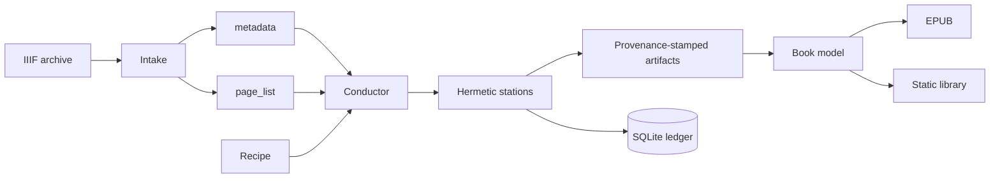

# Palimpsest Factory

Palimpsest is a provenance-first production system for recovering readable
books from manuscript images. An IIIF manifest enters as a work order; a recipe
moves every page through image preparation, reading, translation, editorial
reconstruction, and publication; the outputs are an EPUB and a static-library
reader generated from one book model.

This document describes the implemented system. The live artifact and station
graph is generated from code in [`CONTRACTS.md`](CONTRACTS.md).

## Product boundary

The factory owns the complete path from an archive manifest to a published
book:

1. validate and ingest an IIIF manifest;
2. acquire and normalize page images;
3. identify readable regions and transcribe each page;
4. align transcription columns and translate with manuscript-wide context;
5. reconstruct page fragments into a continuous manuscript;
6. build a bounded reference dossier and an evidence-anchored critical reading;
7. compile a single book model;
8. render EPUB and static-library outputs.

The archive is the source of page identity and imagery. The factory is the
source of every derived artifact. The book model is the source for every
presentation format.

## Command surface

All production commands are top-level Palimpsest commands:

```text
palimpsest init-db
palimpsest intake --doc-id DOC --recipe RECIPE --manifest URL
palimpsest adopt --doc-id DOC --recipe RECIPE
palimpsest run --doc-id DOC
palimpsest status [--doc-id DOC]
palimpsest graph [--format json|mermaid] [--write-docs]
palimpsest preview --doc-id DOC --pages PAGE...
palimpsest tune --doc-id DOC --pages PAGE...
palimpsest evaluate ...
palimpsest site
```

`intake` is the normal entry point. It fetches one IIIF manifest, validates the
selected recipe before writing anything, builds canonical `metadata.json` and
`page_list.json` records, writes both atomically, and creates the work order in
the same command. `adopt` only registers an already-valid canonical workspace.

`run` executes the work order's recipe. A successful full run marks the work
order `complete`; a run containing any failed cell marks it `failed`. Starting
or resuming a run marks it `active`. Operators can park a work order explicitly
through the ledger API without changing its production history.

## Architecture



### Contracts

Every artifact kind has one registry entry defining:

- grain: page or manuscript;
- format: JSON, JPEG, or EPUB;
- required JSON fields;
- canonical workspace location;
- semantic description.

Every station declares one grain, all consumed kinds, exactly one produced
kind, whether it calls a model, and the recipe parameters and options it
accepts. Registration rejects unknown artifact kinds. Recipe loading rejects
unknown station names, missing model or prompt bindings, parameters or options
not declared by the station, and impossible dependency order. JSON outputs are
validated against their artifact contract before they are written.

### Recipes

A recipe is a declarative route sheet with separate page and manuscript lanes.
The page lane is ordered and runs concurrently across pages. The manuscript
lane runs after every page dependency required by its next station is present.

The maintained recipes are:

- `latin_manuscript`
- `chinese_scroll`

Recipe interpolation accepts only the named model settings in factory
configuration. Missing settings fail during recipe loading rather than during
paid work.

### Conductor

The conductor is the only component that knows ordering, concurrency,
freshness, or ledger state. Its unit of execution is a cell:

```text
(document, page or manuscript, station)
```

For each cell it:

1. resolves the station's declared inputs;
2. computes implementation, configuration, and input fingerprints;
3. decides whether to run, skip, or report explicit refresh requirements;
4. appends a running record to the ledger;
5. delegates execution to the configured executor;
6. validates and atomically commits the output;
7. records success, usage, cost, or a structured failure.

Page cells execute through a bounded thread pool. Ledger writes share one
serialized SQLite connection in WAL mode. A manuscript cell never starts until
all required page artifacts exist.

### Executors

Executors receive a fully resolved cell specification and return a structured
cell outcome. They never choose recipe order and never mutate the ledger.

- `inline` runs the station in the conductor process;
- `subprocess` runs a fresh Python process for crash and interpreter isolation;
- configured agent executors stage an airlocked workspace containing only the
  station prompt, declared evidence, relevant images, and an output directory.

Agent-backed stations run a production attempt, validate the artifact, and may
send bounded repair turns into the same session. Exhausted repairs produce a
failed cell; they never produce a placeholder artifact.

### Model gateway

Stations call one gateway interface. A model identifier selects the provider;
stations do not instantiate provider clients. The gateway owns retries,
transient-error classification, structured JSON decoding, token accounting,
and cost calculation. Model, prompt hash, parameters, token use, and cost are
recorded in provenance and the ledger.

### Workspace

Canonical workspaces live under `library/<doc_id>/`. Artifact paths come only
from the contract registry and workspace layout module. Page-grain artifacts
are one file per page under a kind-named directory; manuscript-grain artifacts
use the registry's single filename.

Important source and terminal artifacts are:

```text
library/<doc_id>/
  metadata.json
  page_list.json
  page_image/
  page_image_framed/
  page_image_unmarked/
  page_image_clean/
  page_regions/
  page_transcription/
  page_alignment/
  translation_brief.json
  page_translation/
  page_assembled/
  manuscript.json
  reference.json
  emendations.json
  book/book.json
  book/book.epub
```

The complete path map and required JSON fields are generated in
[`CONTRACTS.md`](CONTRACTS.md).

## Freshness and provenance

A station implementation is identified by a SHA-256 digest of executable
factory source plus the station's qualified identity. No manually named
implementation generation exists. Any factory code drift changes identity
automatically rather than masquerading as fresh work.

The conductor computes two decision fingerprints:

```text
configuration = hash(implementation, model, prompt hash, parameters, options)
inputs        = hash(all declared input content, non-file signature inputs)
```

Decision rules:

- no successful prior run: run;
- configuration and inputs match: skip as fresh;
- inputs changed: run because upstream evidence changed;
- configuration changed: report outdated and require explicit `--refresh`;
- requested refresh: run.

JSON artifact hashing excludes its provenance object, preventing timestamps
from making unchanged content look stale. Binary artifacts hash their bytes.
Every JSON output receives a provenance stamp containing station identity,
configuration and input fingerprints, creation time, model and prompt identity
when applicable, parameters, token use, and cost.

## Ledger

`library/factory.db` contains two durable tables:

- `items`: one work order per document, with recipe, creation time, and
  operational status;
- `stage_runs`: append-only cell executions, fingerprints, output location,
  model usage, cost, timestamps, and failures.

`stage_state` is a view of the latest successful run for each document,
station, and page. Refreshing work appends history; it never overwrites an old
run. Artifacts remain independently auditable from their embedded provenance.

## Editorial model

The editorial line preserves separate evidence layers:

- `page_transcription`: diplomatic page reading;
- `page_alignment`: character-to-image anchors and column geometry;
- `page_translation`: translated page text with context notes;
- `manuscript`: reconstructed continuous original and translation;
- `reference`: bounded external evidence tied to manuscript anchors;
- `emendations`: proposed readings plus an apparatus explaining each change;
- `book`: chapters containing translation, verbatim original, emended reading,
  apparatus, catalog identity, and production colophon.

Emendation never mutates the diplomatic transcription or reconstructed
manuscript. Publication presents the layers together, preserving both readable
text and the evidence required to audit it.

## Publication

`publish` creates the book model as pure structured content. `render_epub`
renders an EPUB from that model. `site` rebuilds the hosted shelf and per-book
reader from all published book models. Presentation code does not read upstream
station artifacts directly.

The publication colophon reports the model and prompt identity for model-backed
stations, implementation fingerprints for every contributing station, total
recorded production cost, source catalog identity, and page count.

## Invariants

1. One artifact kind has one contract and one canonical path.
2. A station has declared inputs and exactly one output.
3. A recipe is validated completely before execution.
4. Only the conductor schedules work or updates production history.
5. Executors and stations never write the ledger.
6. Artifact commits are atomic.
7. Successful history is append-only.
8. Paid work is not repeated after configuration drift without explicit
   operator intent.
9. Source evidence, editorial intervention, and presentation remain distinct.
10. Every published book can be traced to page artifacts, prompts, models,
    implementation content, and archive source.
